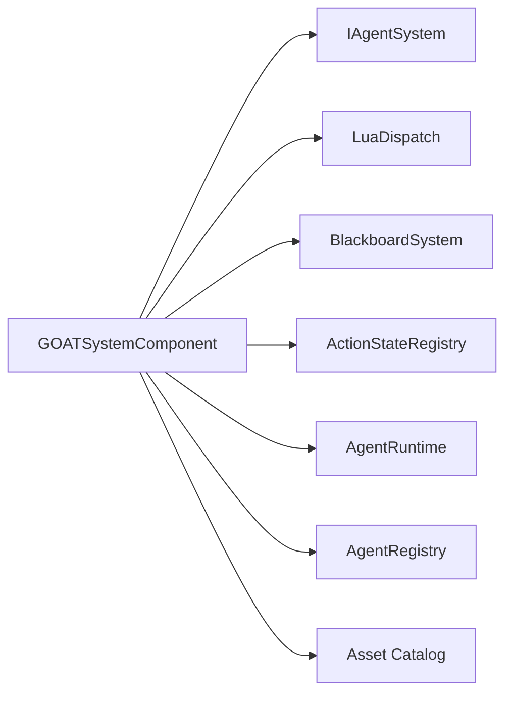

# GOATSystemComponent

> **File Location:** `Code/Source/Clients/GOATSystemComponent.cpp`  
> **Header:** `Code/Source/Clients/GOATSystemComponent.h`  
> **Inherits:** `AZ::Component`, `IAgentSystem`, `GOATRequestBus::Handler`, `AzFramework::AssetCatalogEventBus::Handler`

---

## Overview

`GOATSystemComponent` is the **central "God Object"** of the G.O.A.T. framework. It is an O3DE system component that owns and manages the lifecycle of every core service. It implements the `IAgentSystem` interface, which is the single public API that game modules, backends, and other gems use to extend the framework.

It is responsible for initializing the blackboard schema, registering core actions (`Wait`, `RunScript`), loading the Lua authoring vocabulary, managing the `AgentRegistry`, and bridging the Asset Catalog to ensure scripts are loaded only when the engine is ready.

---

## Key Responsibilities

| # | Responsibility | Description |
| :--- | :--- | :--- |
| 1 | **Service Initialization** | Creates and owns `BlackboardSystem`, `ActionStateRegistry`, `BackendRegistry`, `NodeTypeRegistry`, `TreeLibrary`, `LuaDispatch`, `AgentRuntime`, and `AgentRegistry`. |
| 2 | **Lua Vocabulary Loading** | Searches the Asset Catalog for `goat/scripts/goat.luac` or `goat.lua`, loads it, and runs it to populate the global DSL. |
| 3 | **Agent Management** | Implements `IAgentSystem` methods to compile trees, register/unregister agents, and join squads. |
| 4 | **Console Tooling** | Registers `AZ::Console` commands (`ListBackends`, `ListAgents`, `DumpAgent`, etc.) for runtime debugging. |
| 5 | **Lua Backend Registration** | Detects backends defined in Lua (via `GOAT_HasBackend`) and installs `LuaBackend` wrappers automatically. |

---

## Public Interface

### IAgentSystem Methods

```cpp
// Core interface implementation
bool LoadScript(const AZ::Data::Asset<AZ::ScriptAsset>& asset) override;
AZ::Outcome<void, AZStd::string> LoadBlackboard(const BlackboardAsset& asset) override;
AZ::Outcome<void, AZStd::string> CompileTree(const AZ::Name& treeName) override;
AgentId RegisterAgent(AZ::EntityId entity, const AZ::Name& treeName, size_t band) override;
void UnregisterAgent(AgentId agent) override;
void JoinSquad(AgentId agent, const AZ::Name& squad) override;
bool RegisterBackend(AZStd::unique_ptr<IBackend> backend) override;
void UnregisterBackend(const AZ::Name& name) override;
ActionStateId RegisterAction(AZStd::unique_ptr<IActionState> action) override;
void UnregisterAction(ActionStateId id) override;
```

### Private Core Methods

```cpp
// Lifecycle
void StartServices();
void StopServices();
bool LoadVocabulary();
bool EnsureVocabulary();
void RegisterLuaBackends();
```

---

## Dependencies & Interactions



- **Depends on:** `ScriptService`, `AssetDatabaseService` (declared in `GetDependentServices`).
- **Required by:** `GOATAgentComponent` (via `IAgentSystem` interface).
- **Interacts with:** `LuaDispatch`, `TreeCompiler`, `TreeWalker`, `AgentRuntime`, `BlackboardSystem`.

---

## Implementation Notes

### Key Algorithms

`StartServices()` enforces a **strict initialization order**:

1. Create `BlackboardSystem`, `ActionStateRegistry`, `BackendRegistry`, `NodeTypeRegistry`, `TreeLibrary`.
2. Create `LuaDispatch` and `AgentScriptContext`.
3. Register `DirectBackend` and core `IActionState`s (`WaitAction`, `RunScriptAction`).
4. Create `LuaNodeScripting`, `AgentRuntime`, and `AgentRegistry`.
5. Configure the `LuaPlanBuilder`.
6. Connect `LuaDispatch` to the script context.

### Asset Catalog Deferred Loading

`EnsureVocabulary()` is called by `OnCatalogLoaded`. This is crucial because system components activate *before* the Asset Catalog is ready. If the vocabulary fails to load at `Activate()`, it retries once the catalog is loaded, ensuring the DSL is always available.

### Performance Considerations

- **Allocation:** All heavy services are created once during `StartServices()` and destroyed during `StopServices()`.
- **Tick Rate:** The component itself does not tick. It only registers agents with the `AgentRuntime`, which handles scheduling.
- **Concurrency:** Runs entirely on the main thread.

---

## Lua Exposure

`GOATSystemComponent` is not directly exposed to Lua. Instead, it loads `GOAT.lua` (the vocabulary) into the script context and exposes the runtime services (like `LuaDispatch`, `LuaTreeBuilder`, `LuaPlanBuilder`) to Lua via `BehaviorContext::Reflect()`.

---

## Testing

Unit tests should cover:

- `StartServices` / `StopServices` lifecycle without crashes.
- `LoadVocabulary` correctly falls back to `goat.lua` when `goat.luac` is missing.
- `RegisterAction` and `RegisterBackend` correctly update their respective registries.
- `CompileTree` correctly adds programs to the map and fails on invalid trees.

---

## Related Notes

- [[GOATAgentComponent]]
- [[LuaDispatch]]
- [[TreeCompiler]]
- [[TreeWalker]]
- [[Layered Overview]]

---

*Last updated: 2026-08-26*