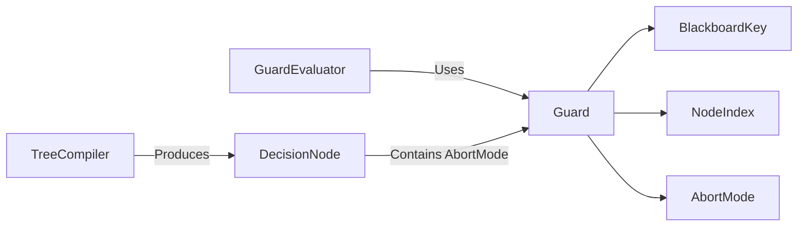

# Guard

> **File Location:** `Code/Source/Backends/BehaviorTree/Code/Include/GOAT_BehaviorTree/Guard.h`  
> **Source:** `Code/Source/Backends/BehaviorTree/Code/Source/Guard.cpp`  
> **Inherits:** None (Plain struct and enum)

---

## Overview

`Guard` defines the **abort conditions** used in behavior trees. It contains the `AbortMode` enum and the `Guard` struct. A `Guard` is attached to a condition node and specifies what should be interrupted when the condition changes.

The system uses Unreal's four observer abort modes:

- `None` – Never interrupts.
- `Self` – Aborts this node and any subtree running under it.
- `LowerPriority` – Aborts any node to the right of this one.
- `Both` – Aborts both of the above.

---

## Key Components

### 1. AbortMode

```cpp
enum class AbortMode : AZ::u8
{
    None,          //!< Never interrupts.
    Self,          //!< Aborts this node and any subtree running under it.
    LowerPriority, //!< Aborts any node to the right of this one.
    Both           //!< Aborts both of the above.
};
```

### 2. Guard

```cpp
struct Guard
{
    BlackboardKey m_key;    //!< Blackboard slot this guard observes.
    NodeIndex m_node = InvalidNodeIndex;  //!< Tree node that declared the guard.
    AbortMode m_abort = AbortMode::None;  //!< What to interrupt when the condition stops holding.
};
```

---

## Public Interface

### Methods

```cpp
// Reflects the guard types for serialization and scripting.
void ReflectGuardTypes(AZ::ReflectContext* context);
```

### Type Alias

```cpp
```

---

## Dependencies & Interactions



- **Depends on:** `BlackboardKey`, `NodeIndex`, `AbortMode`.
- **Required by:** `GuardEvaluator`, `DecisionNode`, `TreeCompiler`.

---

## Implementation Notes

### Key Algorithms

`GuardEvaluator` uses the `Guard` struct to determine whether a guard has been tripped and what action to take (fail or restart). It checks the `AbortMode` against the running leaf's position in the tree.

### Performance Considerations

- **Allocation:** No allocations; plain struct.
- **Tick Rate:** Used only during guard evaluation (when a watched key changes).
- **Concurrency:** Immutable after compilation.

---

## Lua Exposure

Not directly exposed to Lua. Guards are authored via the `abort` property on `condition` and `compare` nodes.

```lua
condition "target_seen" { abort = "lower_priority" }
```

---

## Testing

Unit tests should cover:

- **AbortMode Reflection:** Correctly reflects all four modes.
- **Guard Struct:** Correctly stores key, node, and abort mode.
- **Guards live in the compiled program.** `DecisionProgram::m_guardNodes` lists the node indices that carry one, so re-checking walks a short list instead of the whole tree.

---

## Related Notes

- [[GuardEvaluator]]
- [[AbortMode]]
- [[BlackboardKey]]
- [[DecisionNode]]
- [[TreeCompiler]]

---

*Last updated: 2026-08-26*