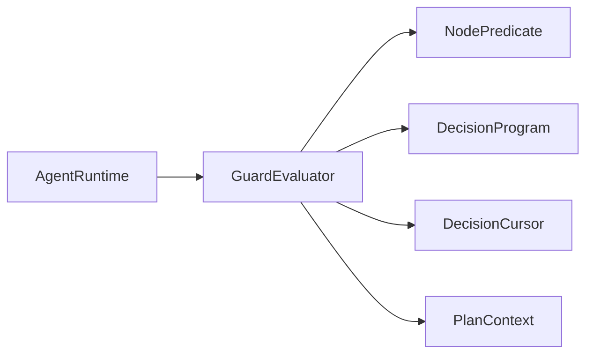

# GuardEvaluator

> **File Location:** `Code/Source/Core/Frontend/GuardEvaluator.cpp`  
> **Header:** `Code/Source/Core/Frontend/GuardEvaluator.h`  
> **Inherits:** None (Plain class)

---

## Overview

`GuardEvaluator` is responsible for **re-checking condition guards** when a watched blackboard slot changes. It implements Unreal's four observer abort modes: `None`, `Self`, `LowerPriority`, and `Both`. It is called by `AgentRuntime` only when `GuardWatch` reports that a watched key is dirty, ensuring idle agents evaluate no conditions at all.

---

## Key Responsibilities

| # | Responsibility | Description |
| :--- | :--- | :--- |
| 1 | **Guard Evaluation** | Checks all guard nodes in a program against the current blackboard state. |
| 2 | **Abort Decision** | Determines whether a running action should be interrupted, and whether it should `Fail` or `Restart`. |
| 3 | **Scope Detection** | Uses pre-order indices to determine whether a leaf is inside a guard's subtree or a lower-priority branch. |

---

## Public Interface

### Methods

```cpp
// Re-checks guards and returns an abort decision.
AbortDecision Evaluate(
    const DecisionProgram& program,
    const DecisionCursor& cursor,
    const PlanContext& context) const;
```

### Return Types

```cpp
enum class AbortAction : AZ::u8
{
    None,   //!< Nothing changed that affects this agent.
    Fail,   //!< A guard around the running branch stopped holding.
    Restart //!< A higher priority guard started holding, so the walk moves there.
};

struct AbortDecision
{
    AbortAction m_action = AbortAction::None;
    NodeIndex m_node = InvalidNodeIndex;
};
```

---

## Dependencies & Interactions



- **Depends on:** `DecisionProgram`, `DecisionCursor`, `PlanContext`, `NodePredicate`.
- **Required by:** `AgentRuntime` (called when an agent's observer is dirty).
- **Interacts with:** `NodePredicate` (to evaluate conditions).

---

## Implementation Notes

### Key Algorithms

`Evaluate()` iterates through `program.m_guardNodes`, checking each one:

1. **Leaf Inside Guard:** If the running leaf is inside the guard's subtree and the guard's condition fails, it returns `AbortAction::Fail`.
2. **Leaf Lower Priority:** If the running leaf is *outside* the guard's subtree and the guard's condition now holds, it returns `AbortAction::Restart`.

```cpp
// Code/Source/Core/Frontend/GuardEvaluator.cpp
AbortDecision GuardEvaluator::Evaluate(...) const
{
    AbortDecision decision;

    const NodeIndex leaf = cursor.GetActiveLeaf();
    if (leaf == InvalidNodeIndex) { return decision; }

    for (const NodeIndex guardIndex : program.m_guardNodes)
    {
        const DecisionNode& guard = program.m_nodes[guardIndex];
        const bool holds = EvaluateNodePredicate(guard, context);

        const bool leafIsInside = leaf >= guardIndex && leaf < guard.m_subtreeEnd;

        if (!holds && leafIsInside &&
            (guard.m_abort == AbortMode::Self || guard.m_abort == AbortMode::Both))
        {
            decision.m_action = AbortAction::Fail;
            decision.m_node = guardIndex;
            return decision;
        }

        if (holds && !leafIsInside && leaf >= guard.m_subtreeEnd &&
            (guard.m_abort == AbortMode::LowerPriority || guard.m_abort == AbortMode::Both))
        {
            decision.m_action = AbortAction::Restart;
            decision.m_node = guardIndex;
            return decision;
        }
    }

    return decision;
}
```

### Performance Considerations

- **Allocation:** No per-tick allocations; iterates a pre-built guard node list.
- **Tick Rate:** Only called when an observed blackboard key changes.
- **Concurrency:** Main thread only.

---

## Lua Exposure

Not directly exposed to Lua. Conditions are authored in Lua using `condition` and `compare` nodes.

---

## Testing

Unit tests should cover:

- **Self Abort:** A guard around the running branch stops holding → `Fail`.
- **Lower Priority Abort:** A higher-priority guard starts holding → `Restart`.
- **No Abort:** No relevant guard changed → `None`.

---

## Related Notes

- [[AbortMode]]
- [[Guard]]
- [[AgentRuntime]]
- [[NodePredicate]]
- [[DecisionProgram]]
- [[DecisionCursor]]

---

*Last updated: 2026-08-26*