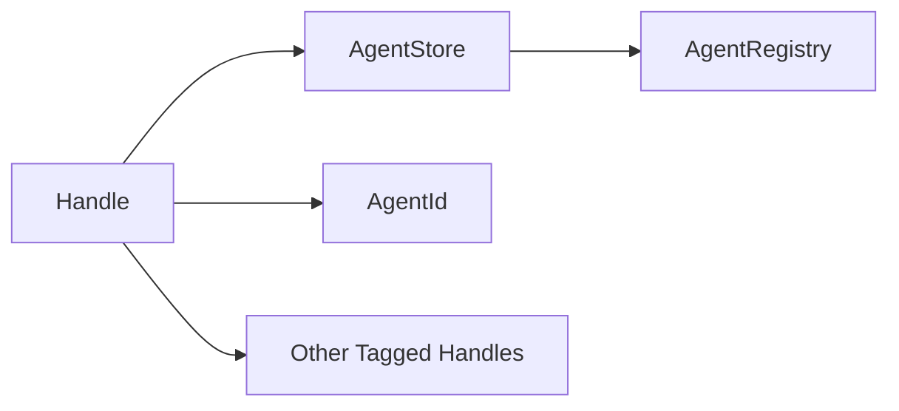

# Handle

> **File Location:** `Code/Include/GOAT/Domain/Handle.h`  
> **Inherits:** None (Template class)

---

## Overview

`Handle` is a **generation-checked reference** to a slot in a `AgentStore`. It provides a safe, stale-proof way to refer to an entry in a dense container. The `Tag` parameter keeps handles of different kinds (e.g., `AgentTag`) from being assigned to each other, providing type safety.

When a slot is released, its generation counter is bumped. Any existing `Handle` pointing to that slot becomes invalid, preventing use-after-free bugs.

---

## Key Responsibilities

| # | Responsibility | Description |
| :--- | :--- | :--- |
| 1 | **Slot Reference** | Stores the slot index and generation counter. |
| 2 | **Stale Detection** | Uses the generation counter to detect when a handle no longer refers to a valid slot. |
| 3 | **Type Safety** | Uses a `Tag` template parameter to prevent accidental cross-type assignment. |
| 4 | **Hashing** | Provides a hash function for use in unordered containers. |

---

## Public Interface

### Methods

```cpp
// Returns the slot index, or NullIndex when the handle is null.
AZ::u32 GetIndex() const;

// Returns the generation counter for this handle.
AZ::u32 GetGeneration() const;

// True when this handle was never pointed at a slot.
bool IsNull() const;

// Comparison operators.
bool operator==(const Handle& rhs) const;
bool operator!=(const Handle& rhs) const;
```

### Constants

```cpp
// Slot index meaning "refers to nothing".
static constexpr AZ::u32 NullIndex = static_cast<AZ::u32>(-1);
```

---

## Dependencies & Interactions



- **Depends on:** None (standalone template).
- **Required by:** `AgentStore`, `AgentId`, `BlackboardKey` (indirectly, via `AgentRegistry`).

---

## Implementation Notes

### Key Algorithms

`Handle` is a simple value type. The `AgentStore` maintains the generation counter and returns a `Handle` to callers. When the slot is released, the generation is incremented, making any previously issued handle invalid.

### Performance Considerations

- **Allocation:** No allocations; plain 64-bit value (index + generation).
- **Tick Rate:** Used in all per-agent operations.
- **Concurrency:** Immutable after creation; safe for concurrent read.

---

## Lua Exposure

Not directly exposed to Lua. Lua receives agent keys as numbers (slot index).

---

## Testing

Unit tests should cover:

- **IsNull:** Correctly returns true for default-constructed handles.
- **GetIndex:** Correctly returns the slot index.
- **GetGeneration:** Correctly returns the generation counter.
- **Comparison:** Correctly compares handles for equality/inequality.
- **Hash:** Correctly hashes handles.

---

## Related Notes

- [[AgentStore]]
- [[AgentId]]
- [[AgentRegistry]]

---

*Last updated: 2026-08-26*