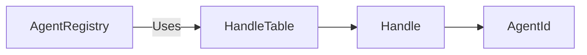

# HandleTable

> **File Location:** `Code/Source/Core/Memory/HandleTable.h`  
> **Inherits:** None (Template class)

---

## Overview

`HandleTable` is a **generation-checked dense storage container**. It provides handles (like `AgentId`) that stay valid across insertions and removals, while keeping the actual data contiguous for cache-friendly iteration. When a slot is released, its generation counter is bumped, so any stale handle becomes invalid instead of aliasing a new value.

It is used by `AgentRegistry` to store `AgentRecord`s in a dense, compact array while maintaining stable handles for external references.

---

## Key Responsibilities

| # | Responsibility | Description |
| :--- | :--- | :--- |
| 1 | **Dense Storage** | Stores values contiguously in a `vector`. |
| 2 | **Handle Management** | Returns generation-checked handles for each value. |
| 3 | **Stale Detection** | Detects stale handles via generation counters. |
| 4 | **Slot Reuse** | Reuses freed slots via a free-list. |
| 5 | **Cache-Friendly Iteration** | Provides `GetValues()` for fast iteration. |

---

## Public Interface

### Methods

```cpp
// Stores a value and returns a handle to it.
template<typename... Args>
HandleType Acquire(Args&&... args);

// Destroys the value a handle refers to. Returns false for a stale handle.
bool Release(HandleType handle);

// True when the handle still refers to a live value.
bool IsValid(HandleType handle) const;

// Returns the value, or nullptr when the handle is stale.
T* Find(HandleType handle);
const T* Find(HandleType handle) const;

// Returns the handle for a value at a dense index, for iterating with handles.
HandleType GetHandleAt(size_t denseIndex) const;

// Live values, contiguous, for cache friendly iteration.
AZStd::vector<T>& GetValues();
const AZStd::vector<T>& GetValues() const;

size_t Size() const;
bool IsEmpty() const;

// Destroys every value and invalidates every outstanding handle.
void Clear();
```

---

## Dependencies & Interactions



- **Depends on:** `Handle<Tag>`.
- **Required by:** `AgentRegistry` (to store `AgentRecord`s).

---

## Implementation Notes

### Key Algorithms

- **`Acquire`:** If a free slot exists, reuse it; otherwise, add a new slot. Append the value to `m_dense` and record its slot index in `m_denseToSlot`.
- **`Release`:** Swap the last element into the removed slot's position to keep `m_dense` contiguous. Bump the slot's generation and push it onto the free-list.
- **`Clear`:** Destroys all values, bumps every generation, and marks all slots as free.

```cpp
// Code/Source/Core/Memory/HandleTable.h
HandleType Acquire(Args&&... args)
{
    AZ::u32 slotIndex;
    if (!m_freeSlots.empty())
    {
        slotIndex = m_freeSlots.back();
        m_freeSlots.pop_back();
    }
    else
    {
        slotIndex = aznumeric_cast<AZ::u32>(m_slots.size());
        m_slots.push_back(Slot{});
    }

    m_dense.emplace_back(AZStd::forward<Args>(args)...);
    m_denseToSlot.push_back(slotIndex);
    m_slots[slotIndex].m_denseIndex = aznumeric_cast<AZ::u32>(m_dense.size() - 1);

    return HandleType(slotIndex, m_slots[slotIndex].m_generation);
}
```

### Performance Considerations

- **Allocation:** Uses `vector` for dense storage; no per-operation heap allocation unless resizing.
- **Tick Rate:** Not called during hot paths; only on registration/unregistration.
- **Concurrency:** Main thread only.

---

## Lua Exposure

Not directly exposed to Lua.

---

## Testing

Unit tests should cover:

- **Acquire/Release:** Correctly managing slots.
- **Stale Handles:** A released handle is invalid.
- **Dense Iteration:** `GetValues()` returns contiguous values.
- **Clear:** All handles become invalid after clearing.
- **Slot Reuse:** Freed slots are reused for new values.

---

## Related Notes

- [[Handle]]
- [[AgentRegistry]]
- [[AgentId]]

---

*Last updated: 2026-08-26*