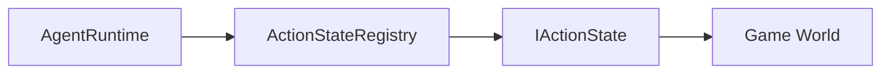

# IActionState

> **File Location:** `Code/Include/GOAT/Interfaces/IActionState.h`  
> **Inherits:** `AZ::RTTI` (via `AZ_RTTI` macro)

---

## Overview

`IActionState` is the **interface for atomic actions** that agents can perform. It is the contract between the `AgentRuntime` and any game-specific behavior (like `MoveTo`, `Attack`, `PlayAnimation`). Actions are registered by name via `ActionStateRegistry` and invoked by `ActionPlan`s.

Unlike the earlier design, the interface uses `Begin`, `Step`, and `End` methods (not `OnStart`, `OnTick`, `OnStop`). A single instance of an action state serves *every* agent, so implementations must keep all mutable state in the `ActionContext` (specifically the `m_scratch` array).

---

## Key Responsibilities

| # | Responsibility | Description |
| :--- | :--- | :--- |
| 1 | **Action Start** | Initializes the action when it first begins via `Begin()`. |
| 2 | **Action Update** | Advances the action every frame while it is running via `Step()`. |
| 3 | **Action End** | Cleans up when the action finishes or is interrupted via `End()`. |
| 4 | **Naming** | Provides a stable `AZ::Name` for registration and lookup. |

---

## Public Interface

### Methods

```cpp
// Name this verb is registered under and referenced by from Lua.
virtual AZ::Name GetName() const = 0;

// Begins the action for one agent.
virtual void Begin(const ActionContext& context) = 0;

// Advances the action. The agent stays in this state while it returns Running.
virtual ActionResult Step(const ActionContext& context, float deltaTime) = 0;

// Ends the action, whether it completed or was aborted.
virtual void End(const ActionContext& context) = 0;
```

### ActionContext Struct

```cpp
struct ActionContext
{
    AgentId m_agent;
    AZ::EntityId m_entity;
    IBlackboardSystem* m_blackboard = nullptr;
    const ActionRequest* m_request = nullptr;
    ActionScratch* m_scratch = nullptr; // 32-byte per-agent scratch
};
```

---

## Dependencies & Interactions



- **Depends on:** `ActionContext`, `ActionRequest`, `ActionResult`.
- **Required by:** `ActionStateRegistry`, `AgentRuntime`.
- **Interacts with:** `AgentRuntime` (via `Begin`, `Step`, `End`).

---

## Implementation Notes

### Key Algorithms

- **`Begin()`** is called once when the action starts. It should use `context.m_scratch` to store per-agent state.
- **`Step()`** is called every frame. It should return `ActionResult::Running` if the action is still in progress, or `Success`/`Failure` if it has completed.
- **`End()`** is called when the action finishes or is aborted. It should clean up any resources.

### Performance Considerations

- **Allocation:** No per-frame allocations; use `m_scratch` for state.
- **Tick Rate:** Called based on the agent's band frequency.
- **Concurrency:** Main thread only.

---

## Lua Exposure

Not directly exposed to Lua. Actions are used via `raw` or `script` nodes:

```lua
raw "MoveTo" { key = "target_position" }
```

---

## Testing

Unit tests should cover:

- **Begin:** Correctly initializes state.
- **Step:** Correctly advances toward completion.
- **End:** Correctly cleans up on interruption.
- **Scratch:** Correctly uses the per-agent `m_scratch` without leaking state.

---

## Related Notes

- [[ActionStateRegistry]]
- [[AgentRuntime]]
- [[ActionPlan]]
- [[Adding New Actions]]

---

*Last updated: 2026-08-26*