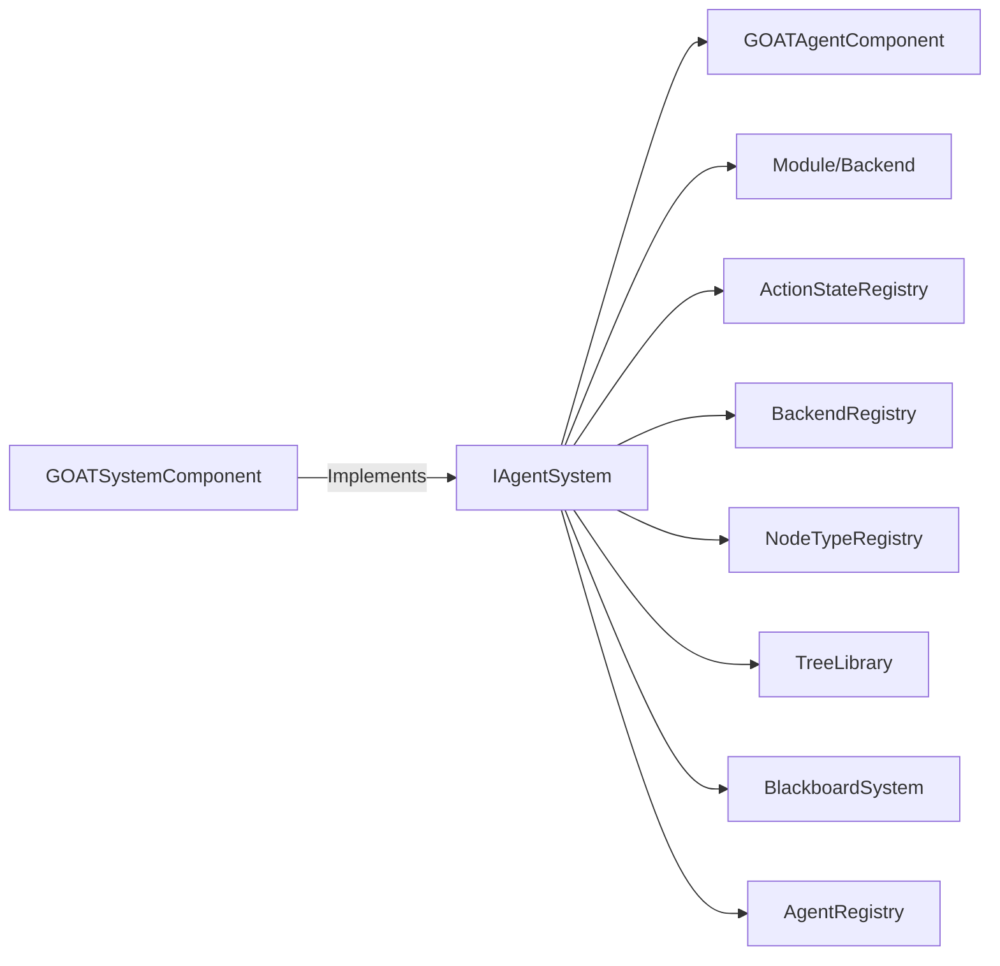

# IAgentSystem

> **File Location:** `Code/Include/GOAT/Interfaces/IAgentSystem.h`  
> **Inherits:** `AZ::RTTI` (via `AZ_RTTI` macro)

---

## Overview

`IAgentSystem` is the **single public API** that modules, backends, and other gems use to extend the G.O.A.T. framework. It is implemented by `GOATSystemComponent` and registered with `AZ::Interface<IAgentSystem>` (via `AgentSystemInterface`). It turns entities into agents and provides the extension points for actions, backends, trees, and blackboard assets.

This interface is the **only surface** a game or an extension gem needs to interact with the framework.

---

## Key Responsibilities

| # | Responsibility | Description |
| :--- | :--- | :--- |
| 1 | **Script Loading** | Runs a Lua script, registering whatever behaviors, backends, and trees it declares. |
| 2 | **Blackboard Loading** | Declares variables from a `.bbx` asset. |
| 3 | **Tree Compilation** | Compiles a declared tree so agents can run it. |
| 4 | **Agent Registration** | Registers an entity as an agent running a compiled tree, with a specified band. |
| 5 | **Agent Unregistration** | Removes an agent and everything held for it. |
| 6 | **Squad Management** | Puts an agent in a named squad, creating that squad on the first join. |
| 7 | **Backend Registration** | Installs or removes a planning backend. |
| 8 | **Action Registration** | Installs or removes an action verb. |
| 9 | **Enumeration** | Provides lists of installed backends, actions, and trees for console output and validation. |
| 10 | **Agent Description** | Provides a one-line summary of what an agent is doing, for the console. |

---

## Public Interface

### Methods

```cpp
// Runs a Lua script, registering whatever behaviours, backends and trees it declares.
virtual bool LoadScript(const AZ::Data::Asset<AZ::ScriptAsset>& asset) = 0;

// Declares the variables a blackboard asset holds. Duplicate names fail.
virtual AZ::Outcome<void, AZStd::string> LoadBlackboard(const BlackboardAsset& asset) = 0;

// Compiles a declared tree so agents can run it.
virtual AZ::Outcome<void, AZStd::string> CompileTree(const AZ::Name& treeName) = 0;

// Registers an entity as an agent running a compiled tree.
virtual AgentId RegisterAgent(AZ::EntityId entity, const AZ::Name& treeName, size_t band) = 0;

// Removes an agent and everything held for it.
virtual void UnregisterAgent(AgentId agent) = 0;

// Puts an agent in a named squad, creating that squad on the first join.
virtual void JoinSquad(AgentId agent, const AZ::Name& squad) = 0;

// Installs a backend. Removing one is what makes backends decoupled.
virtual bool RegisterBackend(AZStd::unique_ptr<IBackend> backend) = 0;
virtual void UnregisterBackend(const AZ::Name& name) = 0;

// Installs an action verb, which is how a module contributes vocabulary.
virtual ActionStateId RegisterAction(AZStd::unique_ptr<IActionState> action) = 0;
virtual void UnregisterAction(ActionStateId id) = 0;

// Names of what is currently installed, for console output and validation.
virtual AZStd::vector<AZ::Name> GetBackendNames() const = 0;
virtual AZStd::vector<AZ::Name> GetActionNames() const = 0;
virtual AZStd::vector<AZ::Name> GetTreeNames() const = 0;

// A one line summary of what an agent is doing, for the console.
virtual AZStd::string DescribeAgent(AgentId agent) const = 0;
```

---

## Dependencies & Interactions



- **Depends on:** `BlackboardAsset`, `AZ::ScriptAsset`, `AgentId`, `IActionState`, `IBackend`, `AZ::Name`, `AZ::Outcome`.
- **Required by:** `GOATAgentComponent`, modules, and backends.
- **Interacts with:** `GOATSystemComponent` (its implementation).

---

## Implementation Notes

### Key Algorithms

`GOATSystemComponent` implements this interface. Each method delegates to the appropriate internal registry or system:

- `LoadScript()` → `LuaDispatch::RunScript()` + `RegisterLuaBackends()`.
- `LoadBlackboard()` → `BlackboardSystem::Declare()` for each variable.
- `CompileTree()` → `LuaDispatch::EmitTree()` + `TreeCompiler::Compile()`.
- `RegisterAgent()` → `AgentRegistry::Register()`.
- `RegisterBackend()` → `BackendRegistry::Register()`.
- `RegisterAction()` → `ActionStateRegistry::Register()`.

### Performance Considerations

- **Allocation:** No per-tick allocations; called only during setup/teardown.
- **Tick Rate:** Not called during runtime ticks.
- **Concurrency:** Main thread only.

---

## Lua Exposure

Not directly exposed to Lua. It is the C++ API for modules.

---

## Testing

Unit tests should cover:

- **Mock Implementation:** All methods can be called and return expected values.
- **Integration with GOATSystemComponent:** Methods delegate correctly.
- **Error Handling:** Invalid inputs (e.g., duplicate names) return appropriate outcomes.

---

## Related Notes

- [[GOATSystemComponent]]
- [[GOATAgentComponent]]
- [[IBackend]]
- [[IActionState]]
- [[BlackboardAsset]]
- [[AgentRegistry]]

---

*Last updated: 2026-08-26*