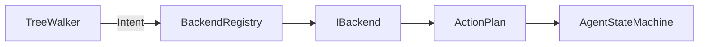

# IBackend

> **File Location:** `Code/Include/GOAT/Interfaces/IBackend.h`  
> **Inherits:** `AZ::RTTI` (via `AZ_RTTI` macro)

---

## Overview

`IBackend` is the **core planning interface** of G.O.A.T. It unifies all AI paradigms (Behavior Trees, HTN, GOAP, Utility AI, Director AI) under a single contract. A backend receives an `Intent` from a tree leaf (via a `delegate` node) and produces an `ActionPlan`—a sequence of `ActionRequest`s that the `AgentStateMachine` will execute.

This interface is what makes G.O.A.T. **backend-driven**: the tree structure never changes, but the planning algorithm behind it can be swapped at runtime.

---

## Key Responsibilities

| # | Responsibility | Description |
| :--- | :--- | :--- |
| 1 | **Plan Generation** | Receives an `Intent` (containing a backend name and goal) and produces an `ActionPlan`. |
| 2 | **Guard Collection** | Optionally reports conditions that invalidate the plan while it runs (for reactive replanning). |
| 3 | **Agent Cleanup** | Releases any per-agent state held by the backend when an agent is unregistered. |
| 4 | **Naming** | Provides a stable `AZ::Name` for registration and lookup. |

---

## Public Interface

### Methods

```cpp
// Name this backend is registered under and referenced by from Lua.
virtual AZ::Name GetName() const = 0;

// Produces a plan for one intent. Returns false when this backend cannot satisfy it.
virtual bool Plan(const PlanContext& context, const Intent& intent, ActionPlan& outPlan) = 0;

// Reports the conditions that invalidate the plan while it runs.
virtual void CollectGuards(
    [[maybe_unused]] const PlanContext& context,
    [[maybe_unused]] const ActionPlan& plan,
    [[maybe_unused]] GuardList& outGuards) const { }

// Releases any per agent state held for this agent.
virtual void Release([[maybe_unused]] const PlanContext& context) { }
```

### PlanContext Struct

```cpp
struct PlanContext
{
    AgentId m_agent;
    AZ::EntityId m_entity;
    IBlackboardSystem* m_blackboard = nullptr;
    INodeScripting* m_scripting = nullptr;
};
```

---

## Dependencies & Interactions



- **Depends on:** `PlanContext`, `Intent`, `ActionPlan`, `GuardList`.
- **Interacts with:** `BackendRegistry` (for registration/lookup), `AgentStateMachine` (to execute the produced plan).
- **Implemented by:** `DirectBackend`, `LuaBackend`, and any future C++ backends (e.g., GOAP, HTN).

---

## Implementation Notes

### Key Algorithms

The `Plan()` method is the core entry point. It receives an `Intent` and must populate `outPlan` with a sequence of `ActionRequest`s.

- **DirectBackend:** Converts a single `ActionRequest` (from `raw` or `script` leaves) into a one-step plan.
- **LuaBackend:** Bridges to Lua, calling the user's `backend "Name" { plan = ... }` function. The returned table of steps is validated by `LuaPlanBuilder` and converted into an `ActionPlan`.

### Performance Considerations

- **Allocation:** Backends should avoid per-tick allocation. `ActionPlan` is a reusable container.
- **Tick Rate:** Planning is triggered only when a `delegate` node is encountered, not every frame.
- **Concurrency:** Runs on the main thread.

---

## Lua Exposure

`IBackend` is **not** directly exposed to Lua. Instead, Lua defines backends using the `backend` function, which C++ wraps in a `LuaBackend` class.

```lua
backend "Errand" {
    plan = function(me, ctx, goal)
        return { { action = "wait", seconds = 2.0 } }
    end,
}
```

The C++ `LuaBackend` implements `IBackend` and calls `LuaDispatch::CallBackendPlan` to invoke the Lua plan function.

---

## Testing

Unit tests for `IBackend` should cover:

- **Plan Generation:** Correctly producing an `ActionPlan` for a given `Intent`.
- **Guard Collection:** Ensuring guards are collected for reactive replanning.
- **Release:** Properly cleaning up per-agent state.
- **Name:** Correctly returning the registered name.

---

## Related Notes

- [[DirectBackend]]
- [[LuaBackend]]
- [[BackendRegistry]]
- [[Extensibility Model]]
- [[Backend Abstraction Theory]]

---

*Last updated: 2026-08-26*