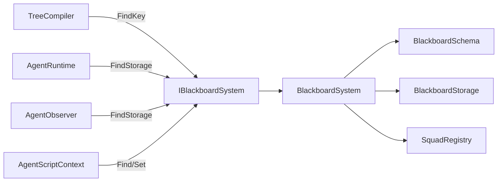

# IBlackboardSystem

> **File Location:** `Code/Include/GOAT/Interfaces/IBlackboardSystem.h`  
> **Inherits:** `AZ::RTTI` (via `AZ_RTTI` macro)

---

## Overview

`IBlackboardSystem` is the **shared data interface** that every stage of the pipeline reads and writes. It holds one global blackboard, one per agent, and one per named squad. It provides type-safe templated access to values via `Find<T>` and `Set<T>`, and resolves variable names to `BlackboardKey`s via `FindKey`.

The concrete implementation is `BlackboardSystem`, which is registered with `BlackboardSystemInterface` (an `AZ::Interface<IBlackboardSystem>`).

---

## Key Responsibilities

| # | Responsibility | Description |
| :--- | :--- | :--- |
| 1 | **Variable Declaration** | Declares a variable and assigns it a slot. Duplicate names fail. |
| 2 | **Key Resolution** | Resolves a name to its `BlackboardKey`, or an invalid key if undeclared. |
| 3 | **Agent Blackboard Lifecycle** | Creates and destroys per-agent blackboards. |
| 4 | **Squad Management** | Puts agents in squads and manages squad storage. |
| 5 | **Storage Access** | Returns the `BlackboardStorage` for a given scope and agent. |
| 6 | **Type-Safe Access** | Provides templated `Find<T>` and `Set<T>` for reading/writing values. |

---

## Public Interface

### Methods

```cpp
// Declares a variable and assigns it a slot.
// Names are shared across every .bbx asset, so a duplicate is an error.
virtual AZ::Outcome<BlackboardKey, AZStd::string> Declare(
    const AZ::Name& name, BlackboardScope scope, BlackboardType type, AZStd::any defaultValue = {}) = 0;

// Resolves a name to its key, or an invalid key when the name is undeclared.
virtual BlackboardKey FindKey(const AZ::Name& name) const = 0;

// Creates the per agent storage used by agent scoped variables.
virtual void CreateAgentBlackboard(AgentId agent) = 0;

// Destroys an agent's storage and drops it from its squad.
virtual void DestroyAgentBlackboard(AgentId agent) = 0;

// Puts an agent in a named squad, creating that squad's storage on the first join.
virtual void JoinSquad(AgentId agent, const AZ::Name& squad) = 0;

// Removes an agent from its squad, destroying that squad's storage on the last leave.
virtual void LeaveSquad(AgentId agent) = 0;

// The squad an agent belongs to, or an empty name when it is in none.
virtual AZ::Name GetSquad(AgentId agent) const = 0;

// Storage backing one scope for one agent, or nullptr when it does not exist.
// Pass a null agent for global scope.
virtual BlackboardStorage* FindStorage(BlackboardScope scope, AgentId agent) = 0;
virtual const BlackboardStorage* FindStorage(BlackboardScope scope, AgentId agent) const = 0;
```

### Templated Helpers

```cpp
// Reads a variable through the storage its key names.
template<typename T>
const T* Find(BlackboardKey key, AgentId agent = {}) const;

// Writes a variable through the storage its key names.
template<typename T>
bool Set(BlackboardKey key, const T& value, AgentId agent = {});
```

---

## Dependencies & Interactions



- **Depends on:** `BlackboardKey`, `BlackboardScope`, `BlackboardType`, `BlackboardStorage`, `AgentId`.
- **Required by:** `TreeCompiler`, `AgentRuntime`, `AgentObserver`, `AgentScriptContext`, `AgentStateMachine`.
- **Implemented by:** `BlackboardSystem`.

---

## Implementation Notes

### Key Algorithms

`BlackboardSystem` implements this interface. The templated helpers use `FindStorage` to get the correct storage and then call `Find<T>` or `Set<T>` on it.

### Performance Considerations

- **Allocation:** No per-tick allocations.
- **Tick Rate:** Key resolution is O(1) after compile time.
- **Concurrency:** Main thread only.

---

## Lua Exposure

Exposed to Lua via `AgentScriptContext` (the `ctx` object). Lua calls `ctx:SetBool`, `ctx:GetInt`, etc., which internally use `IBlackboardSystem` to resolve and access values.

---

## Testing

Unit tests should cover:

- **Declare:** Successfully adding a new variable.
- **FindKey:** Correctly resolving a name to a key.
- **CreateAgentBlackboard:** Correctly creating agent storage.
- **FindStorage:** Correctly returning storage for a scope.
- **Find/Set:** Correctly reading and writing values.

---

## Related Notes

- [[BlackboardSystem]]
- [[BlackboardSchema]]
- [[BlackboardStorage]]
- [[BlackboardKey]]
- [[AgentScriptContext]]

---

*Last updated: 2026-08-26*