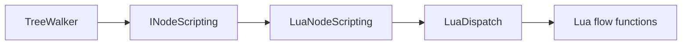

# INodeScripting

> **File Location:** `Code/Include/GOAT/Interfaces/INodeScripting.h`  
> **Inherits:** None (Pure virtual interface)

---

## Overview

`INodeScripting` is the **interface that routes custom control flow** from the `TreeWalker` to the scripting layer (Lua). It allows user-defined `flow` composites and decorators to participate in tree execution. The interface is implemented by `LuaNodeScripting`, which bridges to Lua via `LuaDispatch`.

The walker only knows this interface, so a tree using user-written control flow costs nothing when no script defines any.

---

## Key Responsibilities

| # | Responsibility | Description |
| :--- | :--- | :--- |
| 1 | **Composite Begin** | Asks which child a user-defined composite should run first. |
| 2 | **Composite Advance** | Asks which child should run next after one finishes. |
| 3 | **Decorator Filter** | Asks what status a user-defined decorator reports for its child. |
| 4 | **Node Completion** | Provides the `NoChild` constant for signaling that a node is finished. |

---

## Public Interface

### Constants

```cpp
// Child index meaning "this node is finished", rather than "run this child next".
inline constexpr int NoChild = -1;
```

### Methods

```cpp
// Which child a user defined composite runs first.
// Returns NoChild to finish immediately, reporting through outResult.
virtual int BeginComposite(
    const AZ::Name& behavior,
    const PlanContext& context,
    NodeIndex node,
    int childCount,
    ActionResult& outResult) = 0;

// Which child a user defined composite runs after one finished.
// Returns NoChild to finish, reporting through outResult.
virtual int AdvanceComposite(
    const AZ::Name& behavior,
    const PlanContext& context,
    NodeIndex node,
    int childIndex,
    ActionResult childResult,
    ActionResult& outResult) = 0;

// What a user defined decorator reports for its child's result.
virtual ActionResult FilterDecorator(
    const AZ::Name& behavior,
    const PlanContext& context,
    NodeIndex node,
    ActionResult childResult) = 0;
```

---

## Dependencies & Interactions



- **Depends on:** `PlanContext`, `NodeIndex`, `ActionResult`, `AZ::Name`.
- **Required by:** `TreeWalker` (for `LuaComposite` and `LuaDecorator` nodes).
- **Implemented by:** `LuaNodeScripting`.

---

## Implementation Notes

### Key Algorithms

`TreeWalker` calls `BeginComposite` when it first enters a `LuaComposite` node. It calls `AdvanceComposite` when a child finishes. It calls `FilterDecorator` when a `LuaDecorator` node's child finishes.

### Performance Considerations

- **Allocation:** No allocations.
- **Tick Rate:** Called only when a Lua composite/decorator node is active.
- **Concurrency:** Main thread only.

---

## Lua Exposure

This interface is what makes `flow` definitions in Lua work:

```lua
flow "AllOf" {
    start = function(me, ctx, childCount) return 1 end,
    result = function(me, ctx, childIndex, childStatus)
        if childStatus == FAILURE then return nil, FAILURE end
        if childIndex < me.count then return childIndex + 1 end
        return nil, SUCCESS
    end,
}
```

The `LuaNodeScripting` implementation binds the `AgentScriptContext` and calls `LuaDispatch::CallFlowBegin`, `CallFlowAdvance`, and `CallFlowFilter`.

---

## Testing

Unit tests should cover:

- **BeginComposite:** Correctly returns the first child index.
- **AdvanceComposite:** Correctly returns the next child index.
- **FilterDecorator:** Correctly returns the filtered status.
- **NoChild:** Correctly signals that a node is finished.

---

## Related Notes

- [[LuaNodeScripting]]
- [[LuaDispatch]]
- [[Flows]]
- [[TreeWalker]]

---

*Last updated: 2026-08-26*