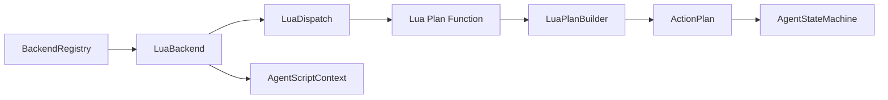

# LuaBackend

> **File Location:** `Code/Source/Core/Scripting/LuaBackend.cpp`  
> **Header:** `Code/Source/Core/Scripting/LuaBackend.h`  
> **Inherits:** `IBackend`

---

## Overview

`LuaBackend` is the **C++ bridge** that allows users to define planning backends entirely in Lua. It implements the `IBackend` interface and delegates the `Plan()` method to a Lua function registered via the `backend` DSL keyword. This enables designers to write complex planning logic without touching C++.

When a tree hits a `delegate` node, the `TreeWalker` creates an `Intent` with a backend name. The `BackendRegistry` looks up that name. If it was registered as a Lua backend, this class handles the call.

---

## Key Responsibilities

| # | Responsibility | Description |
| :--- | :--- | :--- |
| 1 | **Lua Plan Delegation** | Calls the user-defined Lua `plan` function via `LuaDispatch::CallBackendPlan`. |
| 2 | **Context Binding** | Binds the `AgentScriptContext` to the specific agent/entity/blackboard before calling into Lua, and unbinds afterward. |
| 3 | **Plan Validation** | Returns `false` if `CallBackendPlan` returns `nullptr` or an empty `ActionPlan`. |
| 4 | **Backend Registration** | Registered with `BackendRegistry` by `GOATSystemComponent` when a Lua script declares `backend "Name" { ... }`. |

---

## Public Interface

### Constructor

```cpp
LuaBackend(AZ::Name name, LuaDispatch& dispatch, AgentScriptContext& scriptContext);
```

### Methods

```cpp
// Returns the name of the Lua backend (e.g., "Errand").
AZ::Name GetName() const override;

// Calls the Lua plan function and returns the resulting ActionPlan.
bool Plan(const PlanContext& context, const Intent& intent, ActionPlan& outPlan) override;
```

---

## Dependencies & Interactions



- **Depends on:** `LuaDispatch` (to call Lua), `AgentScriptContext` (to bind the agent to the Lua state).
- **Required by:** `GOATSystemComponent` (during `RegisterLuaBackends`).
- **Interacts with:** `LuaPlanBuilder` (to assemble the plan).

---

## Implementation Notes

### Key Algorithms

The `Plan()` method performs a strict, guarded sequence:

1. **Bind:** Calls `m_scriptContext.Bind(context.m_agent, context.m_entity, context.m_blackboard)` to set up the correct Lua environment for this specific agent.
2. **Call:** Calls `m_dispatch.CallBackendPlan(m_name, intent.m_goal, context.m_agent, m_scriptContext)` to execute the Lua backend's `plan` function.
3. **Unbind:** Calls `m_scriptContext.Unbind()` to release the context safely.
4. **Validate:** If the returned pointer is `nullptr` or the plan `IsEmpty()`, it returns `false`. Otherwise, it copies the plan into `outPlan` and returns `true`.

```cpp
// Code/Source/Core/Scripting/LuaBackend.cpp
bool LuaBackend::Plan(const PlanContext& context, const Intent& intent, ActionPlan& outPlan)
{
    m_scriptContext.Bind(context.m_agent, context.m_entity, context.m_blackboard);
    const ActionPlan* planned = m_dispatch.CallBackendPlan(m_name, intent.m_goal, context.m_agent, m_scriptContext);
    m_scriptContext.Unbind();

    if (planned == nullptr || planned->IsEmpty())
    {
        return false;
    }

    outPlan = *planned;
    return true;
}
```

### Performance Considerations

- **Allocation:** `outPlan = *planned;` copies the plan, but `LuaPlanBuilder` reuses buffers to prevent allocation churn.
- **Tick Rate:** Called only when a `delegate` node is encountered, not every frame.
- **Concurrency:** Runs on the main thread. Binding and unbinding ensures no cross-agent state contamination.

---

## Lua Exposure

`LuaBackend` is the **C++ side** of a Lua-defined backend. Users define backends in Lua like this:

```lua
backend "Errand" {
    plan = function(me, ctx, goal)
        if goal == "Rest" then
            return { { action = "wait", seconds = 2.0 } }
        end
        return {
            { action = "script", behavior = "Announce" },
            { action = "wait", seconds = 0.5 },
        }
    end,
}
```

`GOATSystemComponent` automatically detects `backend` declarations and wraps them in `LuaBackend` instances.

---

## Testing

Unit tests should cover:

- **Lua Plan Success:** A valid Lua backend returns a valid `ActionPlan`.
- **Lua Plan Failure:** A Lua backend returns `nil` or an empty table → `Plan()` returns `false`.
- **Unknown Verb:** `LuaPlanBuilder` fails validation and `Plan()` returns `false`.
- **Undeclared Key:** `LuaPlanBuilder` fails validation and `Plan()` returns `false`.
- **Context Isolation:** Ensure `Bind`/`Unbind` correctly prevents state leaking between different agents.

---

## Related Notes

- [[IBackend]]
- [[LuaDispatch]]
- [[LuaPlanBuilder]]
- [[BackendRegistry]]
- [[Backends]]
- [[AgentScriptContext]]

---

*Last updated: 2026-08-26*