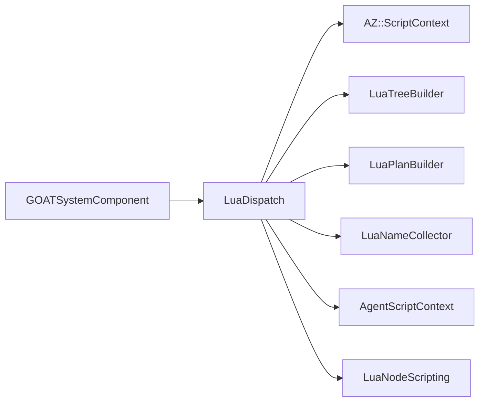

# LuaDispatch

> **File Location:** `Code/Source/Core/Scripting/LuaDispatch.cpp`  
> **Header:** `Code/Source/Core/Scripting/LuaDispatch.h`  
> **Inherits:** None (Plain class instantiated by `GOATSystemComponent`)

---

## Overview

`LuaDispatch` is the **critical bridge** between the C++ core and the Lua authoring vocabulary. It is responsible for calling global functions defined in `GOAT.lua` (like `GOAT_EmitTree`, `GOAT_Dispatch`, `GOAT_Plan`) and marshalling data across the C++/Lua boundary. 

It hides the complexity of `AZ::ScriptContext` and `AZ::ScriptDataContext` from the rest of the engine. It owns the `LuaTreeBuilder`, `LuaPlanBuilder`, and `LuaNameCollector` objects, which are passed to Lua as raw pointers so that Lua can push data into them without C++ reading the Lua stack directly.

---

## Key Responsibilities

| # | Responsibility | Description |
| :--- | :--- | :--- |
| 1 | **Script Execution** | Runs Lua scripts (e.g., `GOAT.lua`) into the shared default script context, registering the global vocabulary. |
| 2 | **Tree Emission** | Calls `GOAT_EmitTree` to extract a compiled `BehaviorTreeNode` hierarchy from Lua. |
| 3 | **Behavior Dispatch** | Calls `GOAT_Dispatch` to run a specific behavior's `start`, `tick`, or `stop` phase, converting the returned integer to an `ActionResult`. |
| 4 | **Backend Planning** | Calls `GOAT_Plan` to invoke user-defined Lua backends, passing a `LuaPlanBuilder` to assemble the resulting `ActionPlan`. |
| 5 | **Flow Routing** | Calls `GOAT_FlowBegin`, `GOAT_FlowAdvance`, and `GOAT_FlowFilter` to execute user-defined custom control flow (composites/decorators). |
| 6 | **Agent Cleanup** | Calls `GOAT_ForgetAgent` to drop per-agent scratch tables when an agent is unregistered. |

---

## Public Interface

### Methods

```cpp
// Binds to the shared script context. Returns false when scripting is unavailable.
bool Connect();
void Disconnect();

// True when the vocabulary is loaded and calls can be made.
bool IsReady() const { return m_scriptContext != nullptr; }

// Runs a script, registering whatever behaviours, backends and trees it declares.
bool RunScript(const AZ::Data::Asset<AZ::ScriptAsset>& asset);

// Asks Lua to hand a declared tree over through the reflected builder.
AZ::Outcome<AZStd::shared_ptr<const BehaviorTreeNode>, AZStd::string> EmitTree(const AZ::Name& treeName);

// Runs one phase of a Lua behaviour and reports what it returned.
ActionResult CallBehavior(
    const AZ::Name& behavior, const char* phase, AgentId agent, AgentScriptContext& context, float deltaTime);

// Runs a Lua backend's plan function. Returns nullptr when it produced nothing.
const ActionPlan* CallBackendPlan(
    const AZ::Name& backend, const AZ::Name& goal, AgentId agent, AgentScriptContext& context);

// True when a backend of that name is defined in Lua.
bool HasLuaBackend(const AZ::Name& backend);

// Every backend name declared in Lua so far.
AZStd::vector<AZ::Name> GetLuaBackendNames();

// Asks Lua which child a user defined composite runs first.
int CallFlowBegin(
    const AZ::Name& flow, AgentId agent, AgentScriptContext& context, NodeIndex node, int childCount, ActionResult& outResult);

// Asks Lua which child a user defined composite runs after one finished.
int CallFlowAdvance(
    const AZ::Name& flow, AgentId agent, AgentScriptContext& context, NodeIndex node, int childIndex, ActionResult childResult, ActionResult& outResult);

// Asks Lua what a user defined decorator reports for its child's result.
ActionResult CallFlowFilter(
    const AZ::Name& flow, AgentId agent, AgentScriptContext& context, NodeIndex node, ActionResult childResult);

// Drops the scratch tables an agent owned, so a reused slot starts clean.
void ForgetAgent(AgentId agent);
```

---

## Dependencies & Interactions



- **Depends on:** `AZ::ScriptContext` (provided by O3DE), `LuaTreeBuilder`, `LuaPlanBuilder`, `LuaNameCollector`, `AgentScriptContext`.
- **Required by:** `GOATSystemComponent`, `LuaNodeScripting`, `RunScriptAction`.
- **Interacts with:** `LuaTreeBuilder` (to receive tree data), `LuaPlanBuilder` (to receive backend plans), `LuaNameCollector` (to list backends).

---

## Implementation Notes

### Key Algorithms

`LuaDispatch` uses O3DE's `AZ::ScriptDataContext` to make *safe* calls into Lua. It prevents the C++ side from having to manually push/pop raw Lua stack values.

1. **Calling Lua Functions:** It uses `m_scriptContext->Call("GOAT_Dispatch", call)`. If the function returns false (doesn't exist), it safely returns failure.
2. **Marshalling Data:** It converts C++ types (e.g., `AZStd::string`, `double`, `AgentId`) into Lua arguments using `call.PushArg()`. It reads Lua return values using `call.ReadResult()`.
3. **Raw Stack Operations:** For `RunScript`, it manually calls `lua_pop(m_scriptContext->NativeContext(), 1)` to clear the return value left on the stack by the script (since `GOAT.lua` returns a table/tree).

### Performance Considerations

- **Allocation:** All calls execute on the main thread. The builders (`m_builder`, `m_planBuilder`) are reused across calls to prevent allocation churn.
- **Tick Rate:** `CallBehavior` is called only when a behavior script needs to tick. The `GOAT_Dispatch` call is the hot path for Lua scripted behaviors.
- **Concurrency:** `AZ::ScriptContext` is not thread-safe. All calls must happen on the main thread.

---

## Lua Exposure

`LuaDispatch` is the **C++ side** of the bridge. It is not exposed to Lua as a callable object, but rather holds the *pointers* to the reflected builders that Lua pushes into.

Example of Lua calling a C++ object:

```lua
-- GOAT.lua
function GOAT_EmitTree(treeName, builder)
    builder:BeginTree(treeName)
    builder:AddNode("selector", 2, 0)
    -- ... etc
    builder:EndTree()
    return true
end
```

The `builder` argument is the `LuaTreeBuilder` passed from `LuaDispatch::EmitTree`.

---

## Testing

Unit tests for `LuaDispatch` should cover:

- **Vocabulary Loading:** `RunScript` correctly loads `GOAT.lua` and registers the global functions.
- **Tree Emission:** `EmitTree` correctly calls `GOAT_EmitTree` and returns a valid `BehaviorTreeNode` (or fails gracefully).
- **Behavior Dispatch:** `CallBehavior` correctly maps Lua integer returns (0, 1, 2) to `ActionResult` (Running, Success, Failure).
- **Backend Planning:** `CallBackendPlan` correctly passes the `LuaPlanBuilder` and returns a valid `ActionPlan`.
- **Error Handling:** Ensuring Lua syntax errors or missing functions return safe fallbacks (e.g., `FAILURE`) instead of crashing.

---

## Related Notes

- [[LuaTreeBuilder]]
- [[LuaPlanBuilder]]
- [[LuaNodeScripting]]
- [[GOATSystemComponent]]
- [[AgentScriptContext]]

---

*Last updated: 2026-08-26*