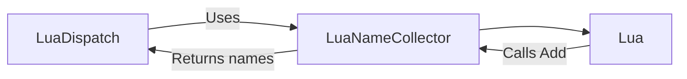

# LuaNameCollector

> **File Location:** `Code/Source/Core/Scripting/LuaNameCollector.cpp`  
> **Header:** `Code/Source/Core/Scripting/LuaNameCollector.h`  
> **Inherits:** None (Plain class, exposed to Lua via `BehaviorContext`)

---

## Overview

`LuaNameCollector` is a **small helper class** that collects a list of names handed over from Lua. It is used by `LuaDispatch` to retrieve the names of all backends declared in Lua, without requiring C++ to directly read a Lua table.

It is passed as an argument to the `GOAT_EmitBackendNames` Lua function, which calls its `Add` method for each name. This keeps all Lua marshalling in the reflection layer.

---

## Key Responsibilities

| # | Responsibility | Description |
| :--- | :--- | :--- |
| 1 | **Name Collection** | Appends names received from Lua into an internal vector. |
| 2 | **Clear** | Discards previously collected names. |
| 3 | **Retrieval** | Provides access to the collected names as `AZ::Name` objects. |
| 4 | **Reflection** | Exposes the `Add` method to Lua via `BehaviorContext`. |

---

## Public Interface

### Methods

```cpp
// Discards anything previously collected.
void Clear();

// Appends one name.
void Add(AZStd::string name);

// Returns the collected names.
const AZStd::vector<AZ::Name>& GetNames() const { return m_names; }
```

---

## Dependencies & Interactions



- **Depends on:** `AZStd::string`, `AZ::Name`, `AZStd::vector`.
- **Required by:** `LuaDispatch` (to get Lua backend names).
- **Interacts with:** Lua (via `GOAT_EmitBackendNames`).

---

## Implementation Notes

### Key Algorithms

`Add()` pushes the string to `m_names` as an `AZ::Name`, filtering out empty strings:

```cpp
void LuaNameCollector::Add(AZStd::string name)
{
    if (!name.empty())
    {
        m_names.emplace_back(name);
    }
}
```

### Performance Considerations

- **Allocation:** `m_names` is a `vector`; grows as needed.
- **Tick Rate:** Called only during registration of Lua backends.
- **Concurrency:** Main thread only.

---

## Lua Exposure

Exposed to Lua as `GoatNameCollector`. Lua calls its `Add` method:

```lua
function GOAT_EmitBackendNames(collector)
    collector:Add("Errand")
    collector:Add("MyGoap")
end
```

---

## Testing

Unit tests should cover:

- **Add:** Correctly appends names.
- **Clear:** Discards previous names.
- **GetNames:** Returns collected names.

---

## Related Notes

- [[LuaDispatch]]
- [[Backends]]
- [[GOATSystemComponent]]

---

*Last updated: 2026-08-26*