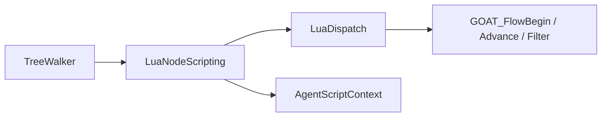

# LuaNodeScripting

> **File Location:** `Code/Source/Core/Scripting/LuaNodeScripting.cpp`  
> **Header:** `Code/Source/Core/Scripting/LuaNodeScripting.h`  
> **Inherits:** `INodeScripting`

---

## Overview

`LuaNodeScripting` is the **bridge** that allows the `TreeWalker` to execute user-defined `flow` logic written in Lua. It implements the `INodeScripting` interface and routes calls to `LuaDispatch`, which invokes the corresponding Lua `flow` functions (`GOAT_FlowBegin`, `GOAT_FlowAdvance`, `GOAT_FlowFilter`).

The walker only knows the interface, so a tree using user-written control flow costs nothing when no script defines any. It is instantiated once by `GOATSystemComponent` and passed to `AgentRuntime` via `PlanContext`.

---

## Key Responsibilities

| # | Responsibility | Description |
| :--- | :--- | :--- |
| 1 | **Composite Begin** | Calls `GOAT_FlowBegin` to ask Lua which child a custom composite runs first. |
| 2 | **Composite Advance** | Calls `GOAT_FlowAdvance` to ask Lua which child runs next after one finishes. |
| 3 | **Decorator Filter** | Calls `GOAT_FlowFilter` to ask Lua what status a decorator reports for its child. |
| 4 | **Context Binding** | Binds `AgentScriptContext` to the specific agent before calling Lua, unbinding afterward. |

---

## Public Interface

### Constructor

```cpp
LuaNodeScripting(LuaDispatch& dispatch, AgentScriptContext& scriptContext);
```

### Methods

```cpp
int BeginComposite(
    const AZ::Name& behavior, const PlanContext& context, NodeIndex node, int childCount, ActionResult& outResult) override;

int AdvanceComposite(
    const AZ::Name& behavior, const PlanContext& context, NodeIndex node, int childIndex,
    ActionResult childResult, ActionResult& outResult) override;

ActionResult FilterDecorator(
    const AZ::Name& behavior, const PlanContext& context, NodeIndex node, ActionResult childResult) override;
```

---

## Dependencies & Interactions



- **Depends on:** `LuaDispatch` (to call Lua), `AgentScriptContext` (to bind agent state).
- **Required by:** `GOATSystemComponent` (passed to `AgentRuntime` via `PlanContext`).
- **Interacts with:** `TreeWalker` (via `INodeScripting` interface).

---

## Implementation Notes

### Key Algorithms

Each method performs a strict sequence:

1. **Bind:** Calls `m_scriptContext.Bind(context.m_agent, context.m_entity, context.m_blackboard)`.
2. **Call:** Invokes the corresponding `LuaDispatch` method.
3. **Unbind:** Calls `m_scriptContext.Unbind()`.
4. **Return:** Returns the result (child index or `ActionResult`).

```cpp
// Code/Source/Core/Scripting/LuaNodeScripting.cpp
int LuaNodeScripting::BeginComposite(
    const AZ::Name& behavior, const PlanContext& context, NodeIndex node, int childCount, ActionResult& outResult)
{
    m_scriptContext.Bind(context.m_agent, context.m_entity, context.m_blackboard);
    const int child =
        m_dispatch.CallFlowBegin(behavior, context.m_agent, m_scriptContext, node, childCount, outResult);
    m_scriptContext.Unbind();
    return child;
}
```

### Performance Considerations

- **Allocation:** No allocations; uses existing `ScriptContext`.
- **Tick Rate:** Called only when a `LuaComposite` or `LuaDecorator` node is hit.
- **Concurrency:** Main thread only (Lua is not thread-safe).

---

## Lua Exposure

Directly exposed to Lua via the `flow` DSL.

```lua
flow "AllOf" {
    start = function(me, ctx, childCount) return 1 end,
    result = function(me, ctx, childIndex, childStatus)
        if childStatus == FAILURE then return nil, FAILURE end
        if childIndex < me.count then return childIndex + 1 end
        return nil, SUCCESS
    end,
}
```

---

## Testing

Unit tests should cover:

- **Begin Composite:** Correctly calls `GOAT_FlowBegin` and returns the child index.
- **Advance Composite:** Correctly calls `GOAT_FlowAdvance` and returns the next child index.
- **Filter Decorator:** Correctly calls `GOAT_FlowFilter` and returns the filtered status.
- **Context Isolation:** Ensure `Bind`/`Unbind` prevents state leaking between agents.

---

## Related Notes

- [[LuaDispatch]]
- [[TreeWalker]]
- [[Flows]]
- [[AgentScriptContext]]
- [[INodeScripting]]

---

*Last updated: 2026-08-26*