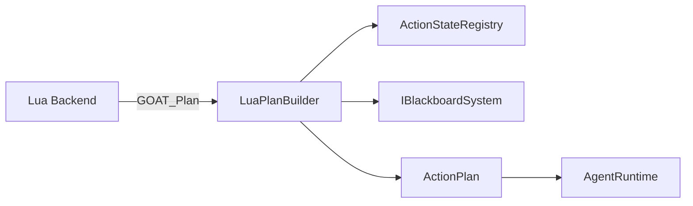

# LuaPlanBuilder

> **File Location:** `Code/Source/Core/Scripting/LuaPlanBuilder.cpp`  
> **Header:** `Code/Source/Core/Scripting/LuaPlanBuilder.h`  
> **Inherits:** None (Plain class, exposed to Lua via `BehaviorContext`)

---

## Overview

`LuaPlanBuilder` is the **C++ counterpart** to the Lua `GOAT_Plan` function. It receives a stream of step definitions from a user-defined Lua backend (via `GOAT_Plan`) and assembles them into a valid `ActionPlan`. 

By using a builder, the C++ core ensures that a Lua backend produces exactly the same format as a C++ backend would. The builder validates every verb against the `ActionStateRegistry` and every blackboard key against the `IBlackboardSystem`, failing the entire plan with a warning if any step references an unknown verb or undeclared variable. This prevents runtime errors from reaching the `AgentRuntime`.

---

## Key Responsibilities

| # | Responsibility | Description |
| :--- | :--- | :--- |
| 1 | **Step Capture** | Receives `AddStep` calls from Lua, appending them to the internal `ActionPlan`. |
| 2 | **Verb Validation** | Resolves the string verb (e.g., `wait`, `MoveTo`) to an `ActionStateId` via the `ActionStateRegistry`. Unknown verbs fail the plan. |
| 3 | **Blackboard Key Validation** | Resolves target blackboard names (e.g., `TargetEntity`) to `BlackboardKey`s via `IBlackboardSystem`. Undeclared keys fail the plan. |
| 4 | **Property Attachment** | Applies optional properties (`SetTag`, `SetDuration`, `SetTolerance`) to the most recently added step. |
| 5 | **Plan Finalization** | `EndPlan` returns `false` if any validation failed or if no steps were provided, ensuring no empty plans are executed. |

---

## Public Interface

### Methods

```cpp
// Points the builder at the registries it needs to resolve names.
void Configure(const ActionStateRegistry* actions, const IBlackboardSystem* blackboard);

// Starts a plan, discarding anything previously built.
void BeginPlan();

// Appends a step running a named verb. Unknown verbs make the plan fail.
void AddStep(AZStd::string verb);

// Sets a property on the most recently added step.
void SetTag(AZStd::string tag);
void SetDuration(double seconds);
void SetTolerance(double tolerance);
void SetTargetKey(AZStd::string blackboardName);

// Finishes the plan. Returns false when a step named something that is not registered.
bool EndPlan();

// The assembled plan, valid once EndPlan returned true.
const ActionPlan& GetPlan() const { return m_plan; }

// Called by AZ::BehaviorContext to expose the builder to Lua.
static void Reflect(AZ::ReflectContext* context);
```

---

## Dependencies & Interactions



- **Depends on:** `ActionStateRegistry` (to validate verbs), `IBlackboardSystem` (to validate blackboard keys).
- **Required by:** `LuaDispatch` (via `m_planBuilder`).
- **Interacts with:** `LuaDispatch` (to receive calls), `AgentRuntime` (to execute the resulting plan).

---

## Implementation Notes

### Key Algorithms

`LuaPlanBuilder` uses a simple validation gate mechanism:

1. **`AddStep(verb)`:** It looks up the verb in `m_actions`. If not found, it sets `m_failed = true` and logs an `AZ_Warning`. If found, it pushes an `ActionRequest` with the resolved ID onto `m_plan.m_steps`.
2. **`SetTargetKey(name)`:** It looks up the name in `m_blackboard`. If not found, it sets `m_failed = true`. If found, it assigns the `BlackboardKey` to the back of `m_plan.m_steps`.
3. **`EndPlan()`:** Returns `!m_failed && !m_plan.IsEmpty()`. If false, the `LuaDispatch` will discard the plan and fall back to `Failure`.

```cpp
// Code/Source/Core/Scripting/LuaPlanBuilder.cpp
void LuaPlanBuilder::AddStep(AZStd::string verb)
{
    if (m_failed) { return; }

    if (m_plan.m_steps.size() >= MaxPlanLength)
    {
        AZ_Warning("GOAT", false, "A Lua backend returned more than %zu steps", MaxPlanLength);
        m_failed = true;
        return;
    }

    const AZ::Name verbName(verb);
    const ActionStateId id = m_actions != nullptr ? m_actions->FindId(verbName) : CoreActions::Invalid;
    if (id == CoreActions::Invalid)
    {
        AZ_Warning("GOAT", false, "A Lua backend asked for unregistered verb '%s'", verbName.GetCStr());
        m_failed = true;
        return;
    }

    ActionRequest request;
    request.m_action = id;
    m_plan.m_steps.push_back(AZStd::move(request));
}
```

### Performance Considerations

- **Allocation:** `m_plan` is cleared and reused on every `BeginPlan` call, avoiding dynamic allocation.
- **Tick Rate:** Called only when a Lua backend is invoked (on `delegate` nodes), not every frame.
- **Concurrency:** Runs on the main thread.

---

## Lua Exposure

`LuaPlanBuilder` is directly exposed to Lua via `BehaviorContext` as `GoatPlanBuilder`. It is passed as a `builder` argument to the `GOAT_Plan` function. 

Example Lua code:

```lua
-- GOAT.lua
function GOAT_Plan(backendName, agentKey, ctx, goal, builder)
    -- Backend returns steps
    builder:BeginPlan()
    builder:AddStep("wait")
    builder:SetDuration(2.0)
    builder:AddStep("script")
    builder:SetTag("Announce")
    return builder:EndPlan()
end
```

---

## Testing

Unit tests for `LuaPlanBuilder` should cover:

- **Valid Plan:** Successfully assembling a plan with registered verbs.
- **Unknown Verb:** Calling `AddStep("UnregisteredVerb")` should set `m_failed` and `EndPlan` should return `false`.
- **Undeclared Blackboard Key:** Calling `SetTargetKey("NonExistentVar")` should set `m_failed` and `EndPlan` should return `false`.
- **Empty Plan:** Calling `EndPlan` immediately after `BeginPlan` should return `false`.
- **Ordering:** Ensure properties are applied to the correct step (the most recent one).

---

## Related Notes

- [[LuaDispatch]]
- [[ActionPlan]]
- [[IBackend]]
- [[ActionStateRegistry]]
- [[Blackboard System]]

---

*Last updated: 2026-08-26*