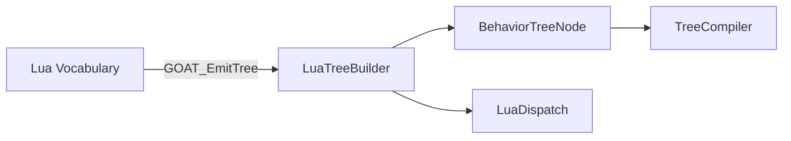

# LuaTreeBuilder

> **File Location:** `Code/Source/Core/Scripting/LuaTreeBuilder.cpp`  
> **Header:** `Code/Source/Core/Scripting/LuaTreeBuilder.h`  
> **Inherits:** None (Plain class, exposed to Lua via `BehaviorContext`)

---

## Overview

`LuaTreeBuilder` is the **C++ counterpart** to the Lua `GOAT.EmitTree` function. It receives a flat, pre-order stream of node calls from the Lua DSL (via `GOAT.lua`) and reconstructs a nested `BehaviorTreeNode` hierarchy. 

The builder acts as a "push-based" assembly mechanism: Lua calls `BeginTree`, `AddNode`, `SetBoolProperty`, etc., and the builder stores these calls in a temporary record list. When `EndTree` is called, it rebuilds the recursive node tree from the flat records, validating that the child counts match the actual number of children provided. This allows the Lua authoring layer to stay completely decoupled from C++ memory management.

---

## Key Responsibilities

| # | Responsibility | Description |
| :--- | :--- | :--- |
| 1 | **Node Capture** | Receives `AddNode` calls with `type`, `childCount`, and `serviceCount`. |
| 2 | **Property Capture** | Receives `SetBoolProperty`, `SetNumberProperty`, and `SetStringProperty` calls for the most recently added node. |
| 3 | **Tree Assembly** | `EndTree` rebuilds the `BehaviorTreeNode` hierarchy from the flat record list, recursively consuming children and services based on the declared counts. |
| 4 | **Validation** | Detects mismatches between declared child/service counts and actual provided nodes, reporting errors via `GetError()`. |
| 5 | **Retrieval** | Provides the assembled `GetRoot()` node and `GetTreeName()` to the caller (`LuaDispatch`). |

---

## Public Interface

### Methods

```cpp
// Starts a new tree, discarding anything previously built.
void BeginTree(AZStd::string name);

// Appends one node in pre-order, declaring how many services and children follow it.
void AddNode(AZStd::string type, int childCount, int serviceCount);

// Sets a property on the most recently added node.
void SetBoolProperty(AZStd::string key, bool value);
void SetNumberProperty(AZStd::string key, double value);
void SetStringProperty(AZStd::string key, AZStd::string value);

// Rebuilds the nesting from the pre-order counts.
void EndTree();

// True when a tree was emitted and rebuilt without error.
bool IsComplete() const { return m_complete; }

// The assembled root, valid once the emission completed.
const BehaviorTreeNode& GetRoot() const { return m_root; }

// Name the emitted tree declared.
const AZStd::string& GetTreeName() const { return m_name; }

// Why the last emission failed, when it did.
const AZStd::string& GetError() const { return m_error; }
```

### Private Data Members

| Member | Type | Description |
| :--- | :--- | :--- |
| `m_records` | `AZStd::vector<Record>` | Flat list of nodes as emitted by Lua. |
| `m_root` | `BehaviorTreeNode` | The assembled root node. |
| `m_name` | `AZStd::string` | Name of the tree being built. |
| `m_error` | `AZStd::string` | Error message if assembly fails. |
| `m_complete` | `bool` | Whether the tree is fully assembled and valid. |

---

## Dependencies & Interactions



- **Depends on:** `BehaviorTreeNode` (the data structure to produce).
- **Required by:** `LuaDispatch` (via `m_builder`).
- **Interacts with:** `LuaDispatch` (to receive calls), `TreeCompiler` (to compile the resulting tree).

---

## Implementation Notes

### Key Algorithms

`LuaTreeBuilder` uses a two-phase approach:

1. **Emission Phase:** Lua pushes node records and properties into the builder. Each record stores its `type`, `childCount`, `serviceCount`, and `properties`.
2. **Reconstruction Phase (`EndTree`):** The builder recursively consumes records from the flat list. It starts at index 0, reads the record, creates a `BehaviorTreeNode`, then consumes `serviceCount` and `childCount` sub-records by calling `Build()` recursively. This mirrors the pre-order flattening that `GOAT.Compile` performs in Lua.

```cpp
// Code/Source/Core/Scripting/LuaTreeBuilder.cpp
size_t LuaTreeBuilder::Build(size_t index, BehaviorTreeNode& out)
{
    if (index >= m_records.size())
    {
        m_error = "Tree emission ended before every declared child was provided";
        return m_records.size();
    }

    const Record& record = m_records[index++];
    out.m_type = record.m_type;
    out.m_properties = record.m_properties;

    for (int i = 0; i < record.m_serviceCount && m_error.empty(); ++i)
    {
        BehaviorTreeNode service;
        index = Build(index, service);
        out.m_services.push_back(AZStd::move(service));
    }

    for (int i = 0; i < record.m_childCount && m_error.empty(); ++i)
    {
        BehaviorTreeNode child;
        index = Build(index, child);
        out.m_children.push_back(AZStd::move(child));
    }

    return index;
}
```

### Performance Considerations

- **Allocation:** The `m_records` vector is reused across calls to prevent reallocation. The `BehaviorTreeNode` hierarchy is allocated dynamically during `EndTree`, but this happens only once per tree compile.
- **Tick Rate:** Not called during runtime; only during asset loading.
- **Concurrency:** Runs on main thread.

---

## Lua Exposure

`LuaTreeBuilder` is directly exposed to Lua via `BehaviorContext` (see `Reflect` method). It is passed as a `builder` argument to the `GOAT_EmitTree` function. 

Example Lua code:

```lua
function GOAT_EmitTree(treeName, builder)
    builder:BeginTree(treeName)
    builder:AddNode("selector", 2, 0)
    builder:AddNode("sequence", 2, 0)
    builder:AddNode("script", 0, 0)
    builder:SetStringProperty("behavior", "Patrol")
    builder:AddNode("wait", 0, 0)
    builder:SetNumberProperty("seconds", 0.5)
    builder:AddNode("script", 0, 0)
    builder:SetStringProperty("behavior", "Alert")
    builder:EndTree()
    return true
end
```

---

## Testing

Unit tests for `LuaTreeBuilder` should cover:

- **Valid Tree Assembly:** Given a flat record list, verify the resulting `BehaviorTreeNode` hierarchy matches the expected nesting.
- **Count Mismatch:** Declaring 2 children but only providing 1 should fail with a descriptive error.
- **Missing Termination:** If `EndTree` is called without any nodes, it should set an error.
- **Property Capture:** Ensure all property types (bool, number, string) are correctly stored.

---

## Related Notes

- [[LuaDispatch]]
- [[TreeCompiler]]
- [[BehaviorTreeNode]]
- [[GOAT.lua]]

---

*Last updated: 2026-08-26*