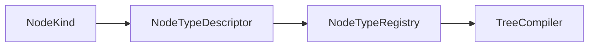

# NodeKind

> **File Location:** `Code/Include/GOAT/Domain/NodeType.h`  
> **Inherits:** None (Enum class)

---

## Overview

`NodeKind` is an **enum class** that categorizes a behavior tree node by its structural role. It determines how many children a node type may have. This is used by `TreeCompiler` to validate authored trees.

---

## Values

| Value | Description |
| :--- | :--- |
| `Composite` | Any number of children (e.g., `selector`, `sequence`). |
| `Decorator` | Exactly one child (e.g., `invert`, `cooldown`). |
| `Leaf` | No children (e.g., `script`, `wait`, `delegate`). |
| `Service` | Attached to a composite and ticked on an interval. |

---

## Dependencies & Interactions



- **Depends on:** None (standalone enum).
- **Required by:** `NodeTypeDescriptor`, `TreeCompiler` (for child count validation).

---

## Implementation Notes

### Key Algorithms

`TreeCompiler::Validate()` uses `NodeKind` to check the child count:

```cpp
bool ChildCountIsLegal(NodeKind kind, size_t childCount)
{
    switch (kind)
    {
    case NodeKind::Composite: return childCount >= 1;
    case NodeKind::Decorator: return childCount == 1;
    case NodeKind::Leaf:
    case NodeKind::Service: return childCount == 0;
    default: return false;
    }
}
```

### Performance Considerations

- **Allocation:** No runtime cost.
- **Tick Rate:** Used only during compilation.

---

## Lua Exposure

Not directly exposed to Lua. Determined by the node type's definition.

---

## Testing

Unit tests should cover:

- **Child Count Validation:** Correctly enforces the number of children.

---

## Related Notes

- [[NodeType]]
- [[NodeTypeDescriptor]]
- [[TreeCompiler]]

---

*Last updated: 2026-08-26*