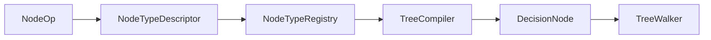

# NodeOp

> **File Location:** `Code/Include/GOAT/Domain/NodeType.h`  
> **Inherits:** None (Enum class)

---

## Overview

`NodeOp` is an **enum class** that defines what a compiled node does when the `TreeWalker` reaches it. It is a closed enum on purpose: extension node types run through the Lua ops (`LuaComposite`, `LuaDecorator`).

---

## Values

| Value | Description |
| :--- | :--- |
| `Selector` | Runs children until one succeeds. |
| `Sequence` | Runs children until one fails. |
| `Parallel` | Runs one main child alongside a background child. |
| `Invert` | Flips its child's success and failure. |
| `ForceSuccess` | Reports success whatever its child does. |
| `Cooldown` | Blocks re-entry until a duration has passed. |
| `Loop` | Repeats its child a fixed number of times. |
| `ConditionalLoop` | Repeats its child while a condition holds. |
| `TimeLimit` | Fails its child once a duration elapses. |
| `Condition` | Guards a subtree on a blackboard value. |
| `Compare` | Guards a subtree on two blackboard values. |
| `Action` | Emits an inline action for the direct backend. |
| `Script` | Runs a Lua behavior. |
| `Delegate` | Hands an intent to a named backend. |
| `Subtree` | Runs another compiled tree. |
| `LuaComposite` | Composite whose control flow is written in Lua. |
| `LuaDecorator` | Decorator whose control flow is written in Lua. |
| `Count` | Sentinel value. |

---

## Dependencies & Interactions

- **Depends on:** None (standalone enum).
- **Required by:** `NodeTypeDescriptor`, `DecisionNode`, `TreeWalker`, `TreeCompiler`.

---

## Implementation Notes

### Key Algorithms

`TreeWalker::Run()` switches on `DecisionNode::m_op` to decide how to traverse the tree. `TreeCompiler::Emit()` sets the `m_op` from the `NodeTypeDescriptor`.

### Performance Considerations

- **Allocation:** No runtime cost.
- **Tick Rate:** Used every frame during tree execution.

---

## Lua Exposure

Not directly exposed to Lua. Determined by the node type's definition.

---

## Testing

Unit tests should cover:

- **Operation Mapping:** Correctly maps `NodeOp` to walker behavior.
- **Reflection:** Correctly reflects all values.

---

## Related Notes

- [[NodeType]]
- [[DecisionNode]]
- [[TreeWalker]]
- [[TreeCompiler]]

---

*Last updated: 2026-08-26*