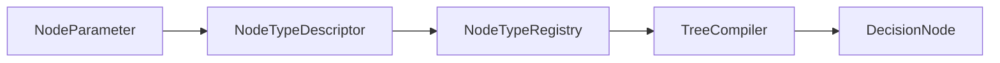

# NodeParameter

> **File Location:** `Code/Include/GOAT/Domain/NodeType.h`  
> **Inherits:** None (Plain struct)

---

## Overview

`NodeParameter` describes **one authored property** that a node type accepts. It defines the property's name, type, whether it refers to a blackboard variable, and whether it is required. It is used by `TreeCompiler` to validate authored nodes against their `NodeTypeDescriptor`.

This drives authoring validation now and a graph editor's property panel later.

---

## Key Responsibilities

| # | Responsibility | Description |
| :--- | :--- | :--- |
| 1 | **Property Declaration** | Names the property and defines its expected type. |
| 2 | **Blackboard Key Flag** | Indicates whether the value is a blackboard variable name rather than a literal. |
| 3 | **Required Flag** | Specifies whether the property must be present for the node to be valid. |

---

## Public Interface

### Data Members

| Member | Type | Description |
| :--- | :--- | :--- |
| `m_name` | `AZ::Name` | Property name as authored. |
| `m_type` | `BlackboardType` | What kind of value the property holds. |
| `m_isBlackboardKey` | `bool` | The value names a blackboard variable rather than being a literal. |
| `m_required` | `bool` | Authoring fails when this property is missing. |

---

## Dependencies & Interactions

- **Depends on:** `AZ::Name`, `BlackboardType`.
- **Required by:** `NodeTypeDescriptor`, `TreeCompiler`.

---

## Implementation Notes

### Key Algorithms

`TreeCompiler` iterates through a descriptor's parameters, looking for authored properties in the node. If a `m_isBlackboardKey` parameter is found, it resolves the name to a `BlackboardKey`. If a `m_required` parameter is missing, it fails validation.

### Performance Considerations

- **Allocation:** No runtime allocations.
- **Tick Rate:** Used only during compilation.
- **Concurrency:** Main thread only.

---

## Lua Exposure

Not directly exposed to Lua. Parameters are defined in `NodeTypeDescriptor`s and resolved during compilation.

---

## Testing

Unit tests should cover:

- **Required Check:** Missing required parameters fail.
- **Blackboard Key Resolution:** Parameters marked as keys are resolved correctly.

---

## Related Notes

- [[NodeType]]
- [[NodeTypeDescriptor]]
- [[BlackboardTypes]]

---

*Last updated: 2026-08-26*