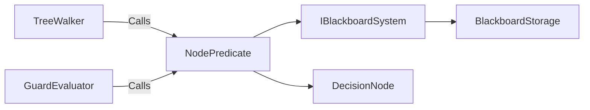

# NodePredicate

> **File Location:** `Code/Source/Backends/BehaviorTree/Code/Source/NodePredicate.cpp`  
> **Header:** `Code/Source/Backends/BehaviorTree/Code/Source/NodePredicate.h`  
> **Inherits:** None (Free function)

---

## Overview

`NodePredicate` is a **free function** that evaluates a condition or comparison node against the blackboard. It is shared by the `TreeWalker` and the `GuardEvaluator` so both read a guard the same way.

It supports two operations:
- **Condition (`NodeOp::Condition`):** Reads a boolean value from a blackboard key.
- **Compare (`NodeOp::Compare`):** Compares two blackboard slots of the same type for equality.

---

## Key Responsibilities

| # | Responsibility | Description |
| :--- | :--- | :--- |
| 1 | **Condition Evaluation** | Reads a boolean value from a blackboard slot. |
| 2 | **Comparison Evaluation** | Compares two blackboard slots of the same type for equality. |
| 3 | **Shared Logic** | Ensures the walker and guard evaluator interpret conditions identically. |
| 4 | **Type Safety** | Validates key types and handles mismatches gracefully. |

---

## Public Interface

### Methods

```cpp
// Evaluates a condition or comparison node against the blackboard.
// Shared by the walker and the guard evaluator so both read a guard the same way.
bool EvaluateNodePredicate(const DecisionNode& node, const PlanContext& context);
```

---

## Dependencies & Interactions



- **Depends on:** `DecisionNode`, `PlanContext`, `IBlackboardSystem`, `BlackboardKey`.
- **Required by:** `TreeWalker`, `GuardEvaluator`.

---

## Implementation Notes

### Key Algorithms

`EvaluateNodePredicate()` first checks if the blackboard and key are valid. If the node is a `Compare`, it calls `SlotsAreEqual()` which compares two slots of the same type. Otherwise, it reads a boolean value from the key.

```cpp
// Code/Source/Backends/BehaviorTree/Code/Source/NodePredicate.cpp
bool EvaluateNodePredicate(const DecisionNode& node, const PlanContext& context)
{
    if (context.m_blackboard == nullptr || !node.m_key.IsValid())
    {
        return false;
    }

    if (node.m_op == NodeOp::Compare)
    {
        return SlotsAreEqual(*context.m_blackboard, node.m_key, node.m_otherKey, context.m_agent);
    }

    const bool* value = context.m_blackboard->Find<bool>(node.m_key, context.m_agent);
    return value != nullptr && *value;
}
```

`SlotsAreEqual()` supports comparisons for `Bool`, `Int`, `Float`, `EntityId`, and `Name` types. It returns `false` for mismatched types or unsupported types.

### Performance Considerations

- **Allocation:** No heap allocations.
- **Tick Rate:** Called during tree walking and guard evaluation.
- **Concurrency:** Main thread only.

---

## Lua Exposure

Not directly exposed to Lua. Conditions are authored in Lua using `condition` and `compare` nodes:

```lua
condition "target_seen" { abort = "lower_priority" }
compare "health" { other = "max_health", abort = "both" }
```

---

## Testing

Unit tests should cover:

- **Condition:** Correctly returns the boolean value at a key.
- **Compare:** Correctly compares two slots of the same type.
- **Invalid Key:** Returns `false` for invalid keys.
- **Mismatched Types:** Returns `false` for type mismatches.

---

## Related Notes

- [[TreeWalker]]
- [[GuardEvaluator]]
- [[DecisionNode]]
- [[BlackboardKey]]
- [[BlackboardStorage]]

---

*Last updated: 2026-08-26*