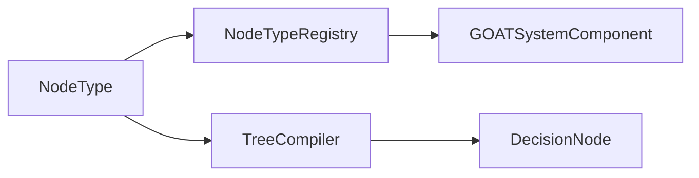

# NodeType

> **File Location:** `Code/Include/GOAT/Domain/NodeType.h`  
> **Source:** `Code/Source/Core/Domain/NodeType.cpp`  
> **Inherits:** None (Plain structs and enums)

---

## Overview

`NodeType` defines the **metadata for a behavior tree node type**. It describes the node's name, kind (Composite/Decorator/Leaf/Service), operation (`NodeOp`), and accepted parameters. The `NodeTypeRegistry` stores these descriptors, and `TreeCompiler` uses them to validate authored trees.

This file contains three key structures: `NodeKind`, `NodeOp`, `NodeParameter`, and `NodeTypeDescriptor`.

---

## Key Components

### 1. NodeKind

```cpp
enum class NodeKind : AZ::u8
{
    Composite, //!< Any number of children.
    Decorator, //!< Exactly one child.
    Leaf,      //!< No children.
    Service    //!< Attached to a composite and ticked on an interval.
};
```

Determines how many children a node type may have.

---

### 2. NodeOp

```cpp
enum class NodeOp : AZ::u8
{
    Selector,        //!< Runs children until one succeeds.
    Sequence,        //!< Runs children until one fails.
    Parallel,        //!< Runs one main child alongside a background child.
    Invert,          //!< Flips its child's success and failure.
    ForceSuccess,    //!< Reports success whatever its child does.
    Cooldown,        //!< Blocks re-entry until a duration has passed.
    Loop,            //!< Repeats its child a fixed number of times.
    ConditionalLoop, //!< Repeats its child while a condition holds.
    TimeLimit,       //!< Fails its child once a duration elapses.
    Condition,       //!< Guards a subtree on a blackboard value.
    Compare,         //!< Guards a subtree on two blackboard values.
    Action,          //!< Emits an inline action for the direct backend.
    Script,          //!< Runs a Lua behavior.
    Delegate,        //!< Hands an intent to a named backend.
    Subtree,         //!< Runs another compiled tree.
    LuaComposite,    //!< Composite whose control flow is written in Lua.
    LuaDecorator,    //!< Decorator whose control flow is written in Lua.
    Count
};
```

What a compiled node does when the walker reaches it. The enum is closed on purpose: extension node types run through the Lua ops.

---

### 3. NodeParameter

```cpp
struct NodeParameter
{
    AZ::Name m_name;
    BlackboardType m_type = BlackboardType::Float;
    bool m_isBlackboardKey = false;
    bool m_required = false;
};
```

One authored parameter a node type accepts. Drives authoring validation now and a graph editor's property panel later.

---

### 4. NodeTypeDescriptor

```cpp
struct NodeTypeDescriptor
{
    AZ::Name m_name;
    NodeKind m_kind = NodeKind::Leaf;
    NodeOp m_op = NodeOp::Action;
    AZStd::string m_category;
    AZStd::string m_description;
    AZStd::vector<NodeParameter> m_parameters;
};
```

Everything the authoring layers need to know about one node type.

---

## Public Interface

### Functions

```cpp
// Reflects the node type enums for serialization and scripting.
void ReflectNodeTypes(AZ::ReflectContext* context);
```

---

## Dependencies & Interactions



- **Depends on:** `BlackboardType`, `AZ::Name`, `AZStd::string`, `AZStd::vector`.
- **Required by:** `NodeTypeRegistry`, `TreeCompiler`, `GOATSystemComponent`.

---

## Implementation Notes

### Key Algorithms

`TreeCompiler` calls `NodeTypeRegistry::Find()` to get a descriptor, then checks required parameters and legal child counts against it.

`NodeTypeRegistry::RegisterBuiltIns()` creates descriptors for all core node types: selector, sequence, invert, force_success, cooldown, loop, conditional_loop, time_limit, condition, compare, wait, raw, script, delegate, composite, decorator, subtree, and service.

### Performance Considerations

- **Allocation:** Stored as static descriptors; no runtime allocation.
- **Tick Rate:** Only used during compilation.
- **Concurrency:** Main thread only.

---

## Lua Exposure

Not directly exposed to Lua. Node types are defined in `GOAT.lua` and registered by `GOATSystemComponent`.

The Lua DSL uses these node constructors:
```lua
selector { ... }
sequence { ... }
script "Patrol"
wait(1.0)
condition "target_seen" { abort = "lower_priority" }
```

---

## Testing

Unit tests should cover:

- **Parameter Validation:** Required parameters are enforced.
- **Kind Validation:** Child counts are correct for each kind.
- **Operation Mapping:** `NodeOp` is correctly assigned.
- **Reflection:** Enums reflect correctly.

---

## Related Notes

- [[NodeTypeRegistry]]
- [[TreeCompiler]]
- [[NodeParameter]]
- [[NodeKind]]
- [[NodeOp]]

---

*Last updated: 2026-08-26*