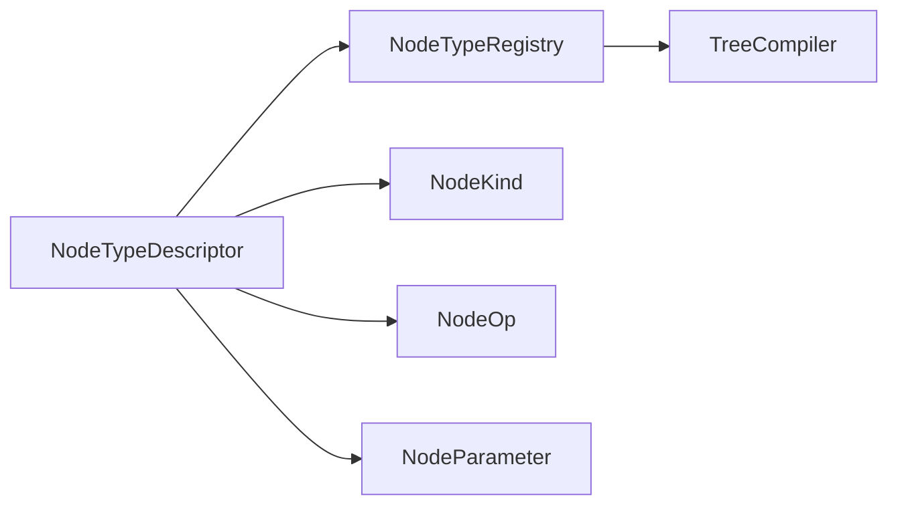

# NodeTypeDescriptor

> **File Location:** `Code/Include/GOAT/Domain/NodeType.h`  
> **Inherits:** None (Plain struct)

---

## Overview

`NodeTypeDescriptor` is the **metadata for one node type**. It defines everything the authoring layers need to know about a node: its name, structural kind, runtime operation, editor category, description, and accepted parameters. It is stored in `NodeTypeRegistry` and used by `TreeCompiler` to validate authored nodes.

---

## Key Responsibilities

| # | Responsibility | Description |
| :--- | :--- | :--- |
| 1 | **Node Identity** | Provides the node's `AZ::Name`. |
| 2 | **Structural Classification** | Defines the node's `NodeKind` (Composite/Decorator/Leaf/Service). |
| 3 | **Runtime Operation** | Maps the node to a `NodeOp` for the `TreeWalker`. |
| 4 | **Editor Metadata** | Stores category and description for the graph editor. |
| 5 | **Parameter Declaration** | Lists accepted `NodeParameter`s for validation. |

---

## Public Interface

### Data Members

| Member | Type | Description |
| :--- | :--- | :--- |
| `m_name` | `AZ::Name` | Name this node type is written as. |
| `m_kind` | `NodeKind` | How many children it may have. |
| `m_op` | `NodeOp` | What the walker does with it. |
| `m_category` | `AZStd::string` | Palette grouping for the graph editor. |
| `m_description` | `AZStd::string` | One line describing what the node is for. |
| `m_parameters` | `AZStd::vector<NodeParameter>` | Properties this node type accepts. |

---

## Dependencies & Interactions

- **Depends on:** `AZ::Name`, `NodeKind`, `NodeOp`, `NodeParameter`, `AZStd::string`, `AZStd::vector`.
- **Required by:** `NodeTypeRegistry`, `TreeCompiler`.

---

## Implementation Notes

### Key Algorithms

`TreeCompiler` calls `NodeTypeRegistry::Find()` to get a descriptor, then validates the authored node against its `m_parameters` and `m_kind`. It uses `m_op` to set the `DecisionNode`'s operation.

### Performance Considerations

- **Allocation:** Stored as static descriptors; no runtime allocation.
- **Tick Rate:** Only used during compilation.
- **Concurrency:** Main thread only.

---

## Lua Exposure

Not directly exposed to Lua. Node types are defined in `GOAT.lua` and registered by `NodeTypeRegistry`.

---

## Testing

Unit tests should cover:

- **Parameter Validation:** Required parameters are enforced.
- **Child Count Validation:** `m_kind` determines legal child counts.
- **Operation Mapping:** `m_op` is correctly used by `TreeWalker`.

---

## Related Notes

- [[NodeType]]
- [[NodeTypeRegistry]]
- [[NodeKind]]
- [[NodeOp]]
- [[NodeParameter]]
- [[TreeCompiler]]

---

*Last updated: 2026-08-26*