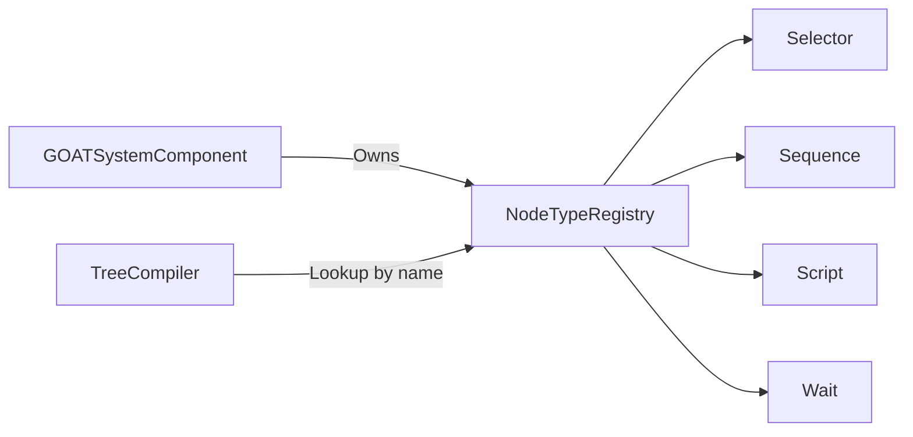

# NodeTypeRegistry

> **File Location:** `Code/Source/Core/Application/NodeTypeRegistry.cpp`  
> **Header:** `Code/Source/Core/Application/NodeTypeRegistry.h`  
> **Inherits:** None (Plain class, owned by `GOATSystemComponent`)

---

## Overview

`NodeTypeRegistry` is the **central lookup table** for all behavior tree node types (like `selector`, `sequence`, `script`, `wait`). It stores `NodeTypeDescriptor`s that define the node's name, kind, operation, and accepted properties. The `TreeCompiler` uses this registry to validate authored trees.

The registry is seeded with all the genre-neutral built-in node types in its constructor via `RegisterBuiltIns()`. Modules and backends can add their own node types at runtime.

---

## Key Responsibilities

| # | Responsibility | Description |
| :--- | :--- | :--- |
| 1 | **Built-In Registration** | Seeds the registry with core node types in `RegisterBuiltIns()`. |
| 2 | **Registration** | Adds a new `NodeTypeDescriptor` by name, failing on duplicates. |
| 3 | **Lookup** | Provides `Find(AZ::Name)` for validation during compilation. |
| 4 | **Unregistration** | Removes a node type, allowing a module to take its vocabulary with it. |
| 5 | **Enumeration** | Provides `GetAll()` for console output and a future graph palette. |

---

## Public Interface

### Methods

```cpp
// Constructor, seeds the built-in node types.
NodeTypeRegistry();

// Adds a node type. Fails when the name is already registered.
bool Register(NodeTypeDescriptor descriptor);

// Removes a node type, so a module can take its vocabulary with it.
void Unregister(const AZ::Name& name);

// The descriptor for a node type name, or nullptr when it is not registered.
const NodeTypeDescriptor* Find(const AZ::Name& name) const;

// Every registered node type, for console output and a future graph palette.
AZStd::vector<const NodeTypeDescriptor*> GetAll() const;
```

### Private Methods

```cpp
// Registers the node types the core always provides.
void RegisterBuiltIns();
```

---

## Dependencies & Interactions



- **Depends on:** `NodeTypeDescriptor`, `AZ::Name`.
- **Required by:** `TreeCompiler` (to validate trees), `GOATSystemComponent` (to provide the vocabulary).

---

## Implementation Notes

### Key Algorithms

`Register()` stores a copy of the descriptor in an `AZStd::unordered_map<AZ::Name, NodeTypeDescriptor>`. `Find()` performs an O(1) hash lookup.

```cpp
// Code/Source/Core/Application/NodeTypeRegistry.cpp
bool NodeTypeRegistry::Register(NodeTypeDescriptor descriptor)
{
    if (descriptor.m_name.IsEmpty())
    {
        return false;
    }

    if (m_types.contains(descriptor.m_name))
    {
        AZ_Warning("GOAT", false, "Node type '%s' is already registered", descriptor.m_name.GetCStr());
        return false;
    }

    m_types.emplace(descriptor.m_name, AZStd::move(descriptor));
    return true;
}
```

### Built-In Node Types

`RegisterBuiltIns()` creates descriptors for all core node types. It uses helper functions:

```cpp
NodeTypeDescriptor Simple(const char* name, NodeKind kind, NodeOp op, const char* category, const char* description);
NodeParameter Param(const char* name, BlackboardType type, bool isKey = false, bool required = false);
```

The built-in types are:
- `selector`, `sequence` (Composites)
- `invert`, `force_success`, `cooldown`, `loop`, `conditional_loop`, `time_limit`, `condition`, `compare`, `decorator` (Decorators)
- `wait`, `raw`, `script`, `delegate`, `subtree` (Leaves)
- `composite` (LuaComposite)
- `service` (Service)

### Performance Considerations

- **Allocation:** No per-tick allocations.
- **Tick Rate:** Only called during tree compilation, not runtime.
- **Concurrency:** Main thread only.

---

## Lua Exposure

Not directly exposed to Lua. The node types are defined in `GOAT.lua` (e.g., `selector`, `sequence`, `script`) and registered via `GOATSystemComponent` during initialization.

---

## Testing

Unit tests should cover:

- **Registration:** Successfully adding a new node type.
- **Duplicate Registration:** Attempting to register a node type with an existing name returns `false`.
- **Find:** Correctly retrieving a node type by name.
- **GetAll:** Returns all registered node types.
- **Built-In Seeding:** Constructor seeds all core node types.

---

## Related Notes

- [[NodeType]]
- [[TreeCompiler]]
- [[GOATSystemComponent]]
- [[NodeParameter]]

---

*Last updated: 2026-08-26*