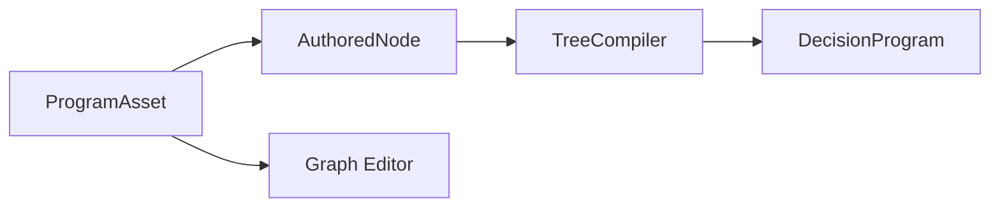

# ProgramAsset

> **File Location:** `Code/Include/GOAT/Assets/ProgramAsset.h`  
> **Source:** `Code/Source/Core/Assets/ProgramAsset.cpp`  
> **Inherits:** `AZ::Data::AssetData`

---

## Overview

`ProgramAsset` is the **authorable asset type** for a program of any paradigm. It is saved as a `.goat` file and represents a program as authored, before it is compiled for execution. The runtime never sees this type, only the program a backend compiled from it.

It is produced by the graph editor, and Lua builds the same thing in memory (via `LuaTreeBuilder`). The asset holds the program's name and its root `AuthoredNode`.

---

## Key Responsibilities

| # | Responsibility | Description |
| :--- | :--- | :--- |
| 1 | **Asset Integration** | Integrates with O3DE's Asset System for loading and editing. |
| 2 | **Tree Storage** | Holds the tree's name and root node. |
| 3 | **Authoring Source** | Serves as the input to `TreeCompiler` for compilation. |
| 4 | **Editor Support** | Uses `EnableForAssetEditor` to appear in the Asset Editor's new asset list. |

---

## Public Interface

### Constants

```cpp
// Source extension the graph editor saves to.
static constexpr const char* FileExtension = "goat";

// Group this asset is filed under in the Asset Editor.
static constexpr const char* AssetGroup = "GOAT";

// Name shown in the Asset Editor's new asset list.
static constexpr const char* DisplayName = "GOAT Program";
```

### Data Members

| Member | Type | Description |
| :--- | :--- | :--- |
| `m_name` | `AZStd::string` | Name agents refer to this program by. |
| `m_root` | `AuthoredNode` | The root of the tree. |

---

## Dependencies & Interactions



- **Depends on:** `AuthoredNode`, `AZ::Data::AssetData`.
- **Required by:** `TreeCompiler` (through `TreeLibrary`), the graph editor.
- **Interacts with:** `LuaTreeBuilder` (in-memory equivalent), `TreeCompiler`.

---

## Implementation Notes

### Key Algorithms

`ProgramAsset::Reflect()` registers the asset with the SerializeContext, enabling it to be saved and loaded. It uses `EnableForAssetEditor` to show in the Asset Editor's new asset list.

`AuthoredProperty`, `AuthoredNodeMetadata`, and `AuthoredNode` are all reflected as supporting types.

### Performance Considerations

- **Allocation:** No runtime allocations.
- **Tick Rate:** Not used during runtime.
- **Concurrency:** Main thread only.

---

## Lua Exposure

Not directly exposed to Lua. The in-memory equivalent is produced by `LuaTreeBuilder` and stored in `TreeLibrary`. This asset is what the graph editor saves.

---

## Testing

Unit tests should cover:

- **Asset Reflection:** The asset type is correctly registered with the SerializeContext.
- **Tree Storage:** Correctly stores the root node.

---

## Related Notes

- [[AuthoredNode]]
- [[AuthoredProperty]]
- [[AuthoredNodeMetadata]]
- [[TreeCompiler]]
- [[TreeLibrary]]

---

*Last updated: 2026-08-26*