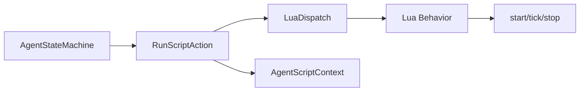

# RunScriptAction

> **File Location:** `Code/Source/Core/Actions/RunScriptAction.cpp`  
> **Header:** `Code/Source/Core/Actions/RunScriptAction.h`  
> **Inherits:** `IActionState`

---

## Overview

`RunScriptAction` is a core **`IActionState`** that runs a Lua behavior. It is registered under the verb name `"script"` and is the mechanism by which Lua scripted behaviors are executed as part of an `ActionPlan`. It bridges the `AgentStateMachine` to the Lua scripting layer.

When the `AgentStateMachine` executes a step with `m_action == CoreActions::RunScript`, it calls this action's `Begin`, `Step`, and `End` methods, which in turn call `LuaDispatch::CallBehavior()` to invoke the appropriate Lua behavior phase (`start`, `tick`, or `stop`).

---

## Key Responsibilities

| # | Responsibility | Description |
| :--- | :--- | :--- |
| 1 | **Lua Behavior Execution** | Runs the named Lua behavior via `LuaDispatch::CallBehavior()`. |
| 2 | **Context Binding** | Binds the `AgentScriptContext` to the current agent/entity/blackboard before calling Lua, and unbinds afterward. |
| 3 | **Lifecycle Mapping** | Maps `Begin` → `"start"`, `Step` → `"tick"`, `End` → `"stop"` phases. |
| 4 | **Result Propagation** | Returns the `ActionResult` from the Lua behavior's `tick` phase. |

---

## Public Interface

### Constructor

```cpp
RunScriptAction(LuaDispatch& dispatch, AgentScriptContext& scriptContext);
```

### Methods

```cpp
AZ::Name GetName() const override;
void Begin(const ActionContext& context) override;
ActionResult Step(const ActionContext& context, float deltaTime) override;
void End(const ActionContext& context) override;
```

---

## Dependencies & Interactions



- **Depends on:** `LuaDispatch` (to call Lua), `AgentScriptContext` (to bind context).
- **Required by:** `GOATSystemComponent` (registered at `CoreActions::RunScript`).
- **Interacts with:** `AgentStateMachine` (via `IActionState` interface).

---

## Implementation Notes

### Key Algorithms

Each method follows a strict pattern: bind the context, call the Lua phase, unbind.

```cpp
// Code/Source/Core/Actions/RunScriptAction.cpp
void RunScriptAction::Begin(const ActionContext& context)
{
    BindContext(context);
    m_dispatch.CallBehavior(context.m_request->m_tag, "start", context.m_agent, m_scriptContext, 0.0f);
    m_scriptContext.Unbind();
}

ActionResult RunScriptAction::Step(const ActionContext& context, float deltaTime)
{
    BindContext(context);
    const ActionResult result =
        m_dispatch.CallBehavior(context.m_request->m_tag, "tick", context.m_agent, m_scriptContext, deltaTime);
    m_scriptContext.Unbind();
    return result;
}

void RunScriptAction::End(const ActionContext& context)
{
    BindContext(context);
    m_dispatch.CallBehavior(context.m_request->m_tag, "stop", context.m_agent, m_scriptContext, 0.0f);
    m_scriptContext.Unbind();
}
```

### Performance Considerations

- **Allocation:** No per-tick allocations.
- **Tick Rate:** Called based on the agent's band frequency.
- **Concurrency:** Main thread only (Lua is not thread-safe).

---

## Lua Exposure

This action is what makes `script "BehaviorName"` work in Lua trees. It is registered under the verb `"script"`.

```lua
script "Patrol"
```

---

## Testing

Unit tests should cover:

- **Begin:** Correctly calls the Lua `start` phase.
- **Step:** Correctly calls the Lua `tick` phase and returns its result.
- **End:** Correctly calls the Lua `stop` phase.
- **Context Binding:** Correctly binds/unbinds the `AgentScriptContext`.

---

## Related Notes

- [[IActionState]]
- [[LuaDispatch]]
- [[AgentScriptContext]]
- [[AgentStateMachine]]
- [[WaitAction]]

---

*Last updated: 2026-08-26*