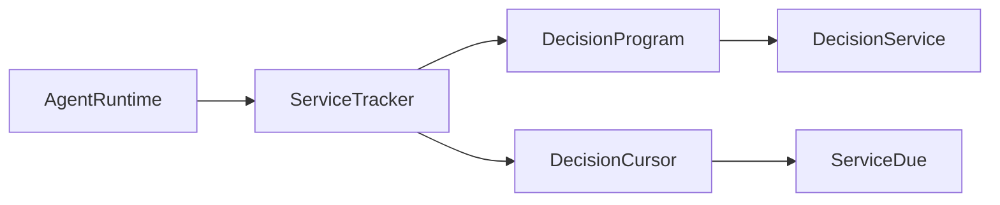

# ServiceTracker

> **File Location:** `Code/Source/Core/Frontend/ServiceTracker.cpp`  
> **Header:** `Code/Source/Core/Frontend/ServiceTracker.h`  
> **Inherits:** None (Plain class)

---

## Overview

`ServiceTracker` determines **which services are due to run** on a given agent tick. A service is considered "in scope" when the agent's active leaf lies inside the composite the service is attached to. It tracks each service's next due time in `DecisionCursor` and schedules future runs.

It is called by `AgentRuntime` every tick and provides the list of due services that should be executed.

---

## Key Responsibilities

| # | Responsibility | Description |
| :--- | :--- | :--- |
| 1 | **Due Collection** | Collects services that are both in scope and past their interval. |
| 2 | **Scheduling** | Advances each collected service's next due time by its interval. |
| 3 | **Scope Filtering** | Uses pre-order indices to determine if a service is currently active. |

---

## Public Interface

### Methods

```cpp
// Collects due services and schedules their next run.
void CollectDue(
    const DecisionProgram& program,
    DecisionCursor& cursor,
    AZStd::vector<AZ::u32>& outServices) const;
```

---

## Dependencies & Interactions



- **Depends on:** `DecisionProgram`, `DecisionCursor`.
- **Required by:** `AgentRuntime` (called every tick).
- **Interacts with:** `DecisionCursor` (to track due times).

---

## Implementation Notes

### Key Algorithms

`CollectDue()` iterates through `program.m_serviceNodes`:

1. **Scope Check:** If the active leaf is inside the node's subtree, the service is in scope.
2. **Due Check:** If `cursor.ServiceDue(service) <= cursor.GetNow()`, the service is due.
3. **Reschedule:** Sets `cursor.ServiceDue(service) = now + interval` and adds it to the output.

```cpp
// Code/Source/Core/Frontend/ServiceTracker.cpp
void ServiceTracker::CollectDue(
    const DecisionProgram& program, DecisionCursor& cursor, AZStd::vector<AZ::u32>& outServices) const
{
    outServices.clear();

    const NodeIndex leaf = cursor.GetActiveLeaf();
    if (leaf == InvalidNodeIndex) { return; }

    const float now = cursor.GetNow();
    for (const NodeIndex nodeIndex : program.m_serviceNodes)
    {
        const DecisionNode& node = program.m_nodes[nodeIndex];

        // In scope means the running leaf is somewhere inside this composite's subtree.
        if (leaf < nodeIndex || leaf >= node.m_subtreeEnd) { continue; }

        for (AZ::u16 offset = 0; offset < node.m_serviceCount; ++offset)
        {
            const AZ::u32 service = node.m_firstService + offset;
            float& due = cursor.ServiceDue(service);
            if (due > now) { continue; }

            due = now + AZStd::max(program.m_services[service].m_interval, 0.0f);
            outServices.push_back(service);
        }
    }
}
```

### Performance Considerations

- **Allocation:** Reuses the output vector (cleared each call).
- **Tick Rate:** Called every agent tick.
- **Concurrency:** Main thread only.

---

## Lua Exposure

Not directly exposed to Lua. Services are authored in Lua using `service "Name" { interval = 0.25 }`.

---

## Testing

Unit tests should cover:

- **In Scope:** Service is collected when the leaf is inside its composite.
- **Out of Scope:** Service is skipped when the leaf is outside.
- **Interval:** Services are rescheduled correctly after running.

---

## Related Notes

- [[AgentRuntime]]
- [[DecisionCursor]]
- [[DecisionProgram]]
- [[DecisionService]]

---

*Last updated: 2026-08-26*