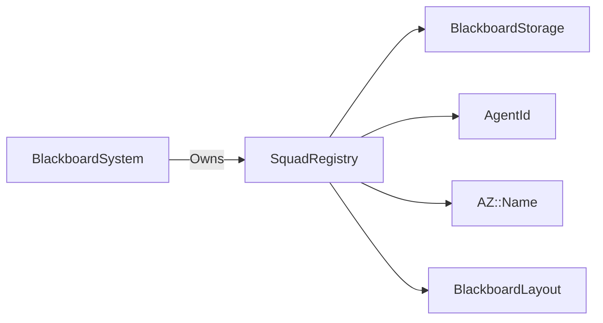

# SquadRegistry

> **File Location:** `Code/Source/Core/Application/SquadRegistry.cpp`  
> **Header:** `Code/Source/Core/Application/SquadRegistry.h`  
> **Inherits:** None (Plain class, owned by `BlackboardSystem`)

---

## Overview

`SquadRegistry` manages **named agent groups** and their squad-scoped blackboard storage. A squad exists only while it has members: it is created on the first join and destroyed on the last leave. This provides a lightweight way to share data between agents in the same group without creating a global variable for every possible squad.

It is used by `BlackboardSystem` to provide `BlackboardScope::Squad` storage.

---

## Key Responsibilities

| # | Responsibility | Description |
| :--- | :--- | :--- |
| 1 | **Squad Membership** | Tracks which agents belong to which squads. |
| 2 | **Storage Management** | Owns the `BlackboardStorage` instance for each squad. |
| 3 | **Lifecycle** | Creates squads on first join, destroys on last leave. |
| 4 | **Lookup** | Provides access to an agent's squad and its storage. |
| 5 | **Capacity Growth** | Grows every live squad's storage when new variables are declared. |

---

## Public Interface

### Methods

```cpp
// Adds an agent to a squad, leaving whatever squad it was in first.
void Join(AgentId agent, const AZ::Name& squad, const BlackboardLayout& layout);

// Removes an agent from its squad. Does nothing when it is in none.
void Leave(AgentId agent);

// The squad an agent belongs to, or an empty name.
AZ::Name Find(AgentId agent) const;

// Storage for the squad an agent belongs to, or nullptr when it is in none.
BlackboardStorage* FindStorage(AgentId agent);
const BlackboardStorage* FindStorage(AgentId agent) const;

// Grows every live squad's storage to a new layout.
void EnsureCapacity(const BlackboardLayout& layout);

// Removes every squad and every membership.
void Clear();
```

---

## Dependencies & Interactions



- **Depends on:** `AgentId`, `AZ::Name`, `BlackboardLayout`, `BlackboardStorage`.
- **Required by:** `BlackboardSystem` (to provide squad scope storage).
- **Interacts with:** `BlackboardSystem` (on join/leave/destroy).

---

## Implementation Notes

### Key Algorithms

#### `Join()`

Adds an agent to a squad. If the agent is already in a squad, it leaves first. If the squad doesn't exist yet, it creates it and resets its storage.

```cpp
// Code/Source/Core/Application/SquadRegistry.cpp
void SquadRegistry::Join(AgentId agent, const AZ::Name& squad, const BlackboardLayout& layout)
{
    if (agent.IsNull() || squad.IsEmpty()) { return; }

    if (Find(agent) == squad) { return; }

    Leave(agent);

    Squad& entry = m_squads[squad];
    if (entry.m_memberCount == 0)
    {
        entry.m_storage.Reset(layout);
    }
    ++entry.m_memberCount;

    m_squadByAgent[agent] = squad;
}
```

#### `Leave()`

Removes an agent from its squad. If the squad has no members left, it is destroyed.

```cpp
void SquadRegistry::Leave(AgentId agent)
{
    const auto membership = m_squadByAgent.find(agent);
    if (membership == m_squadByAgent.end()) { return; }

    const auto squad = m_squads.find(membership->second);
    if (squad != m_squads.end())
    {
        --squad->second.m_memberCount;
        if (squad->second.m_memberCount == 0)
        {
            m_squads.erase(squad);
        }
    }

    m_squadByAgent.erase(membership);
}
```

### Performance Considerations

- **Allocation:** Uses `unordered_map` for O(1) lookup.
- **Tick Rate:** Called only when agents join/leave squads.
- **Concurrency:** Main thread only.

---

## Lua Exposure

Not directly exposed to Lua. Squad membership is set via `IAgentSystem::JoinSquad()` or `GOATAgentComponent`'s `m_squad` property.

---

## Testing

Unit tests should cover:

- **Join:** Correctly creates a squad and adds an agent.
- **Leave:** Correctly removes an agent and destroys empty squads.
- **Find:** Correctly returns the squad an agent belongs to.
- **FindStorage:** Correctly returns the squad's storage.
- **EnsureCapacity:** Correctly grows squad storage when new variables are declared.
- **Clear:** Removes all squads and memberships.

---

## Related Notes

- [[BlackboardSystem]]
- [[BlackboardStorage]]
- [[BlackboardLayout]]
- [[AgentId]]
- [[Blackboard System]]

---

*Last updated: 2026-08-26*