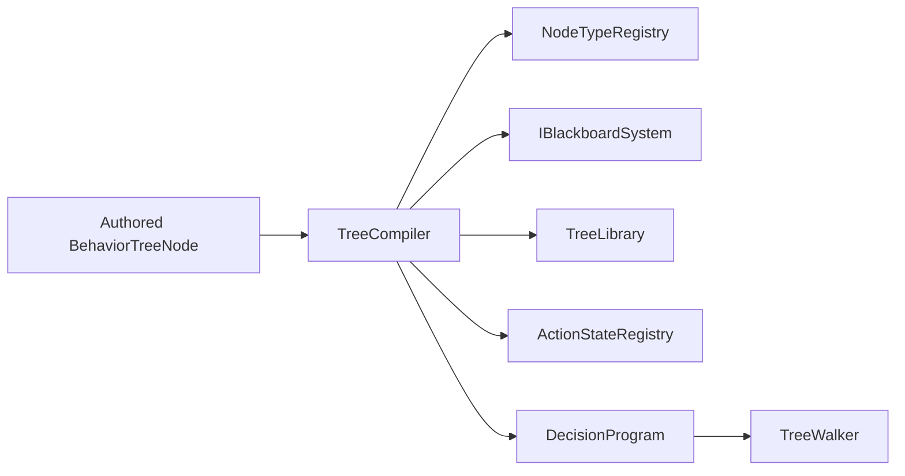

# TreeCompiler

> **File Location:** `Code/Source/Core/Frontend/TreeCompiler.cpp`  
> **Header:** `Code/Source/Core/Frontend/TreeCompiler.h`  
> **Inherits:** None (Plain class, instantiated by `GOATSystemComponent`)

---

## Overview

`TreeCompiler` is the **validation and flattening engine** of G.O.A.T. It takes an authored `BehaviorTreeNode` hierarchy (which comes from Lua or a future graph editor) and converts it into a flat, immutable `DecisionProgram`. This process resolves blackboard variable names into typed keys, validates node properties against registered node types, and precomputes child indices for O(1) traversal during runtime.

The compiler ensures that only valid, type-safe trees reach the execution stage, eliminating runtime string lookups and preventing performance spikes.

---

## Key Responsibilities

| # | Responsibility | Description |
| :--- | :--- | :--- |
| 1 | **Node Validation** | Validates node types against the `NodeTypeRegistry`, checking required properties, legal child counts, and property types. |
| 2 | **Blackboard Resolution** | Converts authored string variable names (e.g., `TargetVisible`) into compiled `BlackboardKey` indices. |
| 3 | **Tree Flattening** | Transforms the recursive `BehaviorTreeNode` graph into a contiguous `AZStd::vector<DecisionNode>` array. |
| 4 | **Subtree Inlining** | Expands `subtree` references recursively, detecting cycles to prevent infinite loops. |
| 5 | **Guard Observation** | Collects the list of `observedKeys` for conditions with `abort` modes, enabling efficient reactive replanning. |
| 6 | **Service Attachment** | Compiles services attached to composites, storing their intervals and names. |

---

## Public Interface

### Methods

```cpp
// Compiles an authored tree into a DecisionProgram.
AZ::Outcome<DecisionProgram, AZStd::string> Compile(const AZ::Name& name, const BehaviorTreeNode& root) const;
```

### Private Methods

```cpp
// Emits one node and its subtree, returning the index it was written to.
AZ::Outcome<NodeIndex, AZStd::string> Emit(
    const BehaviorTreeNode& authored,
    NodeIndex parent,
    AZ::u32 depth,
    DecisionProgram& program,
    AZStd::vector<AZ::Name>& inlining) const;

// Expands a subtree reference in place of the referencing node.
AZ::Outcome<NodeIndex, AZStd::string> Inline(
    const BehaviorTreeNode& authored,
    NodeIndex parent,
    AZ::u32 depth,
    DecisionProgram& program,
    AZStd::vector<AZ::Name>& inlining) const;

// Checks an authored node's properties against what its type accepts.
AZ::Outcome<void, AZStd::string> Validate(
    const BehaviorTreeNode& authored,
    const NodeTypeDescriptor& descriptor) const;
```

---

## Dependencies & Interactions



- **Depends on:** `NodeTypeRegistry` (for node validation), `IBlackboardSystem` (for key resolution), `TreeLibrary` (for subtree references), `ActionStateRegistry` (for verb resolution).
- **Required by:** `GOATSystemComponent`.
- **Produces:** `DecisionProgram` (consumed by `TreeWalker` and shared by multiple agents).

---

## Implementation Notes

### Key Algorithms

The `Compile` method invokes a recursive `Emit` function that performs a **pre-order traversal** of the authored tree:

1. **Depth Check:** If the depth exceeds `MaxTreeDepth` (32), it returns a failure.
2. **Validation:** It checks the node type exists and has the correct property set (`Validate`).
3. **Emission:** It adds a new `DecisionNode` to the `DecisionProgram` vector.
4. **Property Resolution:** It iterates through the node's parameters, resolving `BlackboardKey`s, `AbortMode`s, and numeric values.
5. **Action Resolution:** For `Action`/`Script` leaves, it maps the verb name (either its type or its `raw` tag) to an `ActionStateId` via `ActionStateRegistry`.
6. **Service Collection:** It compiles attached services, storing their intervals and names.
7. **Subtree Emission:** It recursively emits children, recording `firstChild` and `subtreeEnd` indices to allow the `TreeWalker` to navigate the flat array without a stack.

### Performance Considerations

- **Allocation:** The `DecisionProgram` is allocated in a contiguous vector, ensuring high cache locality during runtime.
- **Tick Rate:** Compilation happens once during load time. The resulting program is immutable and shared by all agents running the same tree.
- **Concurrency:** Runs on the main thread during entity activation or script loading. No runtime concurrency issues.

---

## Lua Exposure

`TreeCompiler` is **not** directly exposed to Lua. Lua communicates with the compiler indirectly through `LuaDispatch` → `LuaTreeBuilder`.

Here is the indirect flow:

1. Lua executes `GOAT_EmitTree`.
2. `LuaTreeBuilder` reconstructs the `BehaviorTreeNode` hierarchy.
3. `GOATSystemComponent` passes that hierarchy to `TreeCompiler::Compile`.

---

## Testing

Unit tests for `TreeCompiler` should cover:

- **Validation Failures:** Unknown node types, missing required properties, invalid child counts.
- **Blackboard Resolution:** Referencing undeclared variables should fail with a descriptive error.
- **Subtree Inlining:** Correctly expanding subtrees and detecting circular references.
- **Flattening:** Ensuring `subtreeEnd` and `firstChild` indices are correct for deeply nested trees.
- **Guard Collection:** Ensuring `observedKeys` are unique and sorted for efficient change detection.
- **Service Compilation:** Services are correctly stored with their intervals.

---

## Related Notes

- [[TreeWalker]]
- [[LuaDispatch]]
- [[LuaTreeBuilder]]
- [[DecisionProgram]]
- [[NodeTypeRegistry]]
- [[BlackboardKey]]

---

*Last updated: 2026-08-26*