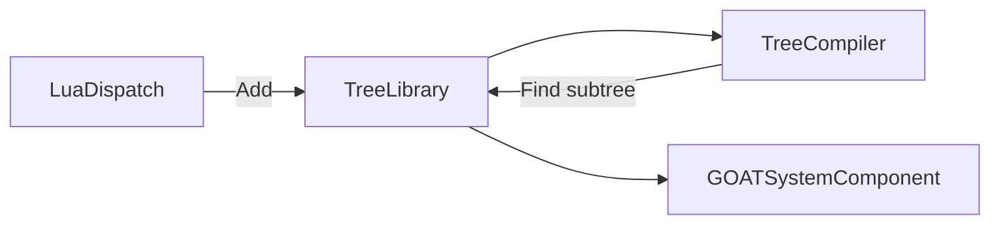

# TreeLibrary

> **File Location:** `Code/Source/Core/Frontend/TreeLibrary.cpp`  
> **Header:** `Code/Source/Core/Frontend/TreeLibrary.h`  
> **Inherits:** None (Plain class, owned by `GOATSystemComponent`)

---

## Overview

`TreeLibrary` is the **registry for authored trees**. It stores `AuthoredNode` hierarchies by name, allowing the `TreeCompiler` to resolve `subtree` references and inline them at compile time. It also supports dynamic rebinding via slots (`Tag`), which is how a director or a gameplay system can swap a subtree at runtime without changing the tree structure.

It holds authored roots rather than assets, so an in-memory tree from Lua and a loaded `.goat` asset are the same thing to the compiler.

---

## Key Responsibilities

| # | Responsibility | Description |
| :--- | :--- | :--- |
| 1 | **Tree Storage** | Stores `AuthoredNode` hierarchies by `AZ::Name`. |
| 2 | **Subtree Lookup** | Provides `Find(AZ::Name)` for `TreeCompiler` to inline subtrees. |
| 3 | **Slot Binding** | Manages dynamic bindings between slot names and tree names (for directors/rebinding). |
| 4 | **Enumeration** | Provides `GetNames()` for console output. |
| 5 | **Cleanup** | Clears all trees and bindings during shutdown. |

---

## Public Interface

### Methods

```cpp
// Adds or replaces a tree under a name.
void Add(const AZ::Name& name, AZStd::shared_ptr<const AuthoredNode> root);

// The authored root registered under a name, or nullptr when there is none.
const AuthoredNode* Find(const AZ::Name& name) const;

// Removes a tree.
void Remove(const AZ::Name& name);

// Binds a named slot to a tree, which is how a subtree is swapped at runtime.
// Rebinding a slot means recompiling the trees that reference it.
void Bind(const AZ::Name& slot, const AZ::Name& treeName);

// The tree bound to a slot, or an empty name when the slot is unbound.
AZ::Name GetBinding(const AZ::Name& slot) const;

// Every registered tree name, for console output.
AZStd::vector<AZ::Name> GetNames() const;

void Clear();
```

---

## Dependencies & Interactions



- **Depends on:** `AuthoredNode`, `AZ::Name`, `AZStd::shared_ptr`.
- **Required by:** `TreeCompiler` (to resolve subtrees), `GOATSystemComponent` (to store trees).

---

## Implementation Notes

### Key Algorithms

`Add()` stores a shared pointer to the tree. `Find()` performs an O(1) hash lookup. `Bind()` allows dynamic rebinding of subtree slots, enabling directors to change which tree a slot points to at runtime.

```cpp
// Code/Source/Core/Frontend/TreeLibrary.cpp
void TreeLibrary::Add(const AZ::Name& name, AZStd::shared_ptr<const AuthoredNode> root)
{
    if (name.IsEmpty() || root == nullptr) { return; }
    m_trees[name] = AZStd::move(root);
}

const AuthoredNode* TreeLibrary::Find(const AZ::Name& name) const
{
    const auto found = m_trees.find(name);
    return found != m_trees.end() ? found->second.get() : nullptr;
}
```

### Performance Considerations

- **Allocation:** Uses `shared_ptr` for safe sharing.
- **Tick Rate:** Only called during compilation.
- **Concurrency:** Main thread only.

---

## Lua Exposure

Indirectly exposed via the `subtree` DSL keyword.

```lua
subtree "Guard"
```

Or through a rebindable slot:

```lua
subtree "PatrolSlot" { tag = "current_patrol" }
```

Then at runtime, a director can rebind the slot:

```lua
-- In a backend or service
ctx:SetName("current_patrol", "Guard")
```

---

## Testing

Unit tests should cover:

- **Add:** Successfully storing a tree.
- **Find:** Correctly retrieving a tree by name.
- **Remove:** Removing a tree.
- **Bind/GetBinding:** Correctly managing dynamic slot bindings.
- **Clear:** Clearing all trees and bindings.

---

## Related Notes

- [[TreeCompiler]]
- [[LuaDispatch]]
- [[LuaTreeBuilder]]
- [[AuthoredNode]]
- [[Director AI]]

---

*Last updated: 2026-08-26*