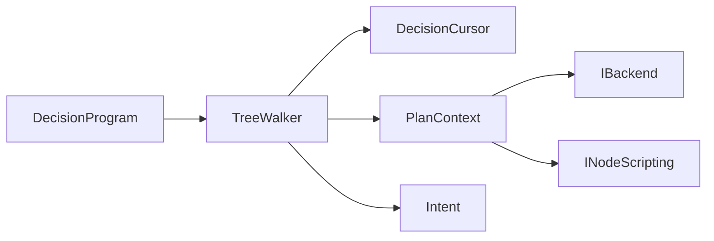

# TreeWalker

> **File Location:** `Code/Source/Core/Frontend/TreeWalker.cpp`  
> **Header:** `Code/Source/Core/Frontend/TreeWalker.h`  
> **Inherits:** None (Plain class instantiated by `AgentRuntime`)

---

## Overview

`TreeWalker` is the **runtime execution engine** of G.O.A.T. It takes a compiled `DecisionProgram` and walks it iteratively, frame by frame, producing `Intent`s for leaf nodes (actions, scripts, or delegates). 

Instead of using recursion (which risks stack overflow on deep trees), it uses an explicit loop and a `DecisionCursor` to track per-node state (child indices, deadlines, loop counters). It handles all standard composites (Selector, Sequence), decorators (Invert, ForceSuccess, Loop, TimeLimit), and custom Lua-defined flows through the `INodeScripting` interface.

---

## Key Responsibilities

| # | Responsibility | Description |
| :--- | :--- | :--- |
| 1 | **Iterative Tree Execution** | Walks the flat `DecisionProgram` array without recursion, avoiding stack overflows. |
| 2 | **Composite Handling** | Executes `Selector`, `Sequence`, and custom `LuaComposite` logic for branching decisions. |
| 3 | **Decorator Handling** | Processes `Invert`, `ForceSuccess`, `Cooldown`, `Loop`, `ConditionalLoop`, and `TimeLimit` nodes. |
| 4 | **Condition & Abort Logic** | Evaluates `Condition` and `Compare` nodes, handling `Restart` for lower-priority aborts when observed keys change. |
| 5 | **Intent Emission** | When hitting an `Action`, `Script`, or `Delegate` leaf, creates an `Intent` and hands it to the Backend Registry. |

---

## Public Interface

### Methods

```cpp
// Rewinds to the root and produces the first intent.
WalkStep Begin(const DecisionProgram& program, DecisionCursor& cursor, const PlanContext& context) const;

// Reports how the running intent's plan ended and produces the next intent.
WalkStep Advance(
    const DecisionProgram& program, DecisionCursor& cursor, const PlanContext& context, ActionResult lastResult) const;

// Re-enters the tree at a node a lower priority guard just started allowing.
WalkStep Restart(
    const DecisionProgram& program, DecisionCursor& cursor, const PlanContext& context, NodeIndex node) const;
```

### Private Methods

```cpp
// Runs the walk from a node, either descending into it or bubbling a result out of it.
WalkStep Run(
    const DecisionProgram& program, DecisionCursor& cursor, const PlanContext& context, 
    NodeIndex node, bool bubbling, ActionResult result) const;

// Builds the intent a leaf node emits.
Intent MakeIntent(const DecisionNode& node, NodeIndex index) const;
```

---

## Dependencies & Interactions



- **Depends on:** `DecisionProgram` (the compiled tree), `DecisionCursor` (per-agent state), `PlanContext` (agent context and blackboard).
- **Interacts with:** `BackendRegistry` (via the produced `Intent`), `INodeScripting` (for custom Lua flows).
- **Required by:** `AgentRuntime` (for ticking agents).

---

## Implementation Notes

### Key Algorithms

The core method is `Run()`, which is an iterative loop using a `bubbling` flag:

1. **Descending (bubbling=false):** The walker looks at the current node. If it's a `Selector` or `Sequence`, it resets the `childIndex` to 0 and moves to the first child. If it's a `Condition`, it evaluates the predicate; on failure, it sets `bubbling=true`. If it's a `Leaf` (Action/Script/Delegate), it sets the `activeLeaf` and returns an `Intent`.
2. **Bubbling (bubbling=true):** The walker looks at the parent node. If it's a `Selector` and the child failed, it moves to the next sibling. If it's a `Sequence` and the child succeeded, it moves to the next sibling. If it's an `Invert`, it flips the result. If it's a `Cooldown`, it sets the deadline. 
3. **Lua Composites/Decorators:** When it hits a `LuaComposite` or `LuaDecorator`, it calls `context.m_scripting` (which routes to Lua) to ask for the next child index or to filter the result.

### Performance Considerations

- **Allocation:** Uses a pre-allocated `DecisionCursor` for state tracking (child indices, deadlines, counters) – no dynamic allocation per tick.
- **Tick Rate:** Runs based on the agent's `Band` (0 to 3), allowing distant/idle agents to run less frequently.
- **Concurrency:** Runs on the main thread only.

---

## Lua Exposure

`TreeWalker` is **not** directly exposed to Lua. However, it heavily relies on `INodeScripting` (implemented by `LuaNodeScripting`) to execute custom `flow` functions defined by users in Lua (e.g., `flow "AllOf" { ... }`). 

Example of a user-defined flow in Lua that the walker executes:

```lua
flow "AllOf" {
    start = function(me, ctx, childCount) return 1 end,
    result = function(me, ctx, childIndex, childStatus) 
        if childStatus == FAILURE then return nil, FAILURE end
        if childIndex < me.count then return childIndex + 1 end
        return nil, SUCCESS
    end,
}
```

---

## Testing

Unit tests for `TreeWalker` should cover:

- **Selector Logic:** Failing over to the next child when one fails; succeeding early when one succeeds.
- **Sequence Logic:** Stopping on the first failure; succeeding only when all children succeed.
- **Decorator Logic:** `Invert` flipping Success to Failure, `ForceSuccess` forcing success, `Cooldown` blocking entry until deadline.
- **Loop Logic:** Repeating children the correct number of times.
- **Abort Logic:** `Restart()` correctly re-enters the tree at the triggered node.
- **Custom Lua Flows:** Ensuring `BeginComposite`, `AdvanceComposite`, and `FilterDecorator` are called correctly.

---

## Related Notes

- [[TreeCompiler]]
- [[DecisionCursor]]
- [[LuaNodeScripting]]
- [[AgentRuntime]]
- [[DirectBackend]]

---

*Last updated: 2026-08-26*