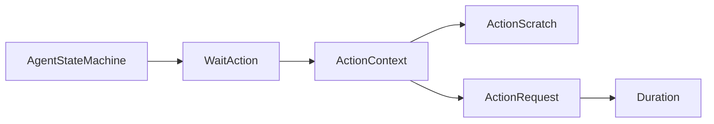

# WaitAction

> **File Location:** `Code/Source/Core/Actions/WaitAction.cpp`  
> **Header:** `Code/Source/Core/Actions/WaitAction.h`  
> **Inherits:** `IActionState`

---

## Overview

`WaitAction` is a core **`IActionState`** that simply waits for a specified duration. It is registered under the verb name `"wait"` and is one of the two core actions provided by the engine (`Wait` and `RunScript`). It is genre-neutral and lives in the core rather than a module.

It uses the `ActionContext`'s scratch buffer to store the elapsed time for the current agent, ensuring that a single `WaitAction` instance can serve many agents without shared state.

---

## Key Responsibilities

| # | Responsibility | Description |
| :--- | :--- | :--- |
| 1 | **Timing** | Tracks how long the action has been running using the agent's scratch buffer. |
| 2 | **Completion** | Returns `Running` until the elapsed time reaches the request's duration, then returns `Success`. |
| 3 | **Reset** | Resets the elapsed time to zero on `Begin`. |

---

## Public Interface

### Methods

```cpp
AZ::Name GetName() const override;   // Returns "wait"
void Begin(const ActionContext& context) override;
ActionResult Step(const ActionContext& context, float deltaTime) override;
void End(const ActionContext& context) override;
```

---

## Dependencies & Interactions



- **Depends on:** `ActionContext`, `ActionRequest`, `ActionScratch`.
- **Required by:** `GOATSystemComponent` (registered at `CoreActions::Wait`).
- **Interacts with:** `AgentStateMachine` (via `IActionState` interface).

---

## Implementation Notes

### Key Algorithms

The elapsed time is stored in the first 4 bytes of the scratch buffer:

```cpp
// Code/Source/Core/Actions/WaitAction.cpp
float& Elapsed(const ActionContext& context)
{
    return *reinterpret_cast<float*>(context.m_scratch->data());
}
```

`Begin()` resets the elapsed time to zero. `Step()` increments it by `deltaTime` and checks if it has reached the request's duration.

```cpp
void WaitAction::Begin(const ActionContext& context)
{
    Elapsed(context) = 0.0f;
}

ActionResult WaitAction::Step(const ActionContext& context, float deltaTime)
{
    float& elapsed = Elapsed(context);
    elapsed += deltaTime;
    return elapsed >= context.m_request->m_duration ? ActionResult::Success : ActionResult::Running;
}
```

### Performance Considerations

- **Allocation:** No heap allocations; uses scratch buffer.
- **Tick Rate:** Called every frame while waiting.
- **Concurrency:** Per-agent state stored in scratch, so a single instance is safe.

---

## Lua Exposure

This action is what makes `wait(1.0)` work in Lua trees. It is registered under the verb `"wait"`.

```lua
wait(0.5)
```

It can also be used as a raw action:

```lua
raw "wait" { seconds = 0.25 }
```

---

## Testing

Unit tests should cover:

- **Begin:** Resets elapsed time to zero.
- **Step:** Returns `Running` until duration is reached, then `Success`.
- **Scratch:** Correctly stores elapsed time per agent without shared state.

---

## Related Notes

- [[IActionState]]
- [[RunScriptAction]]
- [[AgentStateMachine]]
- [[ActionContext]]

---

*Last updated: 2026-08-26*