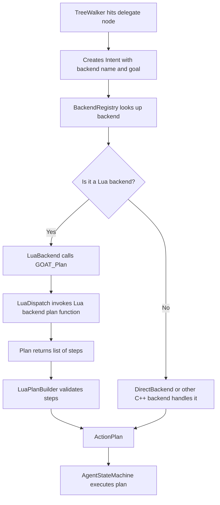

# Backends

> **Asset Type:** Lua Script  
> **Location:** `Assets/GOAT/Scripts/GOAT.lua`  
> **Prerequisites:** [[Vocabulary]], [[Behavior DSL]]

---

## 📌 Purpose

A **backend** is a planning algorithm. In G.O.A.T., you can write an entire planning backend in Lua using the `backend` function. This allows you to implement GOAP, HTN, or simple task-based planners without touching any C++ code. 

When a tree hits a `delegate` node, the `TreeWalker` creates an `Intent` with the backend name and a `goal`. The C++ core looks up the backend (via `BackendRegistry`) and calls its `plan` function, which returns an `ActionPlan`—a sequence of steps the `AgentRuntime` will execute.

---

## 🗝️ Backend Anatomy

A backend is defined with a single `plan` function.

```lua
backend "MyBackend" {
    plan = function(me, ctx, goal)
        -- Return a table of steps, or nil/false if planning fails.
    end,
}
```

### Parameters

| Parameter | Type | Description |
| :--- | :--- | :--- |
| `me` | Table | Per-agent scratch state for this backend instance. |
| `ctx` | Table | The blackboard context (`SetBool`, `GetInt`, etc.). |
| `goal` | String | The goal passed by the `delegate` node. |

### Return Values

| Return | Description |
| :--- | :--- |
| `table` | A list of steps. Each step is a table describing an action. |
| `nil` or `false` | Planning failed; the tree returns `FAILURE`. |

---

## 🧩 Step Properties

Each step in the returned table can have the following properties:

| Property | Type | Description |
| :--- | :--- | :--- |
| `action` | String | (Required) The verb to run (e.g., `wait`, `script`, or a registered module action like `MoveTo`). |
| `behavior` | String | Used with `action = "script"`. Names the Lua behavior to run. |
| `tag` | String | A tag to pass to the action (e.g., the name of a verb). |
| `seconds` | Number | Used with `action = "wait"`. Duration to wait. |
| `tolerance` | Number | An optional tolerance for movement or completion. |
| `key` | String | A blackboard variable name to use as the target (e.g., `TargetEntity`). |

---

## 🧩 Full Example (From `ExampleAdvanced.lua`)

```lua
-- A simple backend that fulfills errands.
backend "Errand" {
    plan = function(me, ctx, goal)
        if goal == "Rest" then
            return { { action = "wait", seconds = 2.0 } }
        end
        return {
            { action = "script", behavior = "Announce" },
            { action = "wait", seconds = 0.5 },
        }
    end,
}
```

**Usage in a tree:**

```lua
return tree "ExampleAdvanced" {
    composite "AllOf" {
        decorator "NeverFails" { script "Chore" },
        delegate "Errand" { goal = "Deliver" },
        raw "wait" { seconds = 0.25 },
    },
}
```

---

## 🗺️ Visual Overview (Execution Flow)



---

## 🧠 How it Connects to C++

The `backend` function registers the Lua code in `GOAT._backends[name]`. 

When a `delegate` node is executed:

1. The **C++ `LuaBackend`** (a class implementing `IBackend`) intercepts the call.
2. It calls `LuaDispatch::CallBackendPlan()`, which calls the Lua function `GOAT_Plan`.
3. `GOAT_Plan` invokes the user's `plan` function.
4. The user's `plan` function returns a table of steps.
5. `GOAT_Plan` pushes those steps into a `LuaPlanBuilder` (a C++ object passed via reflection).
6. The `LuaPlanBuilder` validates the verbs and blackboard keys.
7. The resulting `ActionPlan` is returned to the `AgentStateMachine`.

---

## 🧩 Auto-Registration

You don't need to manually register Lua backends with the C++ system. `GOATSystemComponent` automatically scans for any backend declared in Lua during `RegisterLuaBackends()`.

```cpp
// Code/Source/Core/Application/GOATSystemComponent.cpp
void GOATSystemComponent::RegisterLuaBackends()
{
    for (const AZ::Name& name : m_dispatch->GetLuaBackendNames())
    {
        if (m_backends->Find(name) != nullptr) { continue; }
        m_backends->Register(AZStd::make_unique<LuaBackend>(name, *m_dispatch, *m_scriptContext));
    }
}
```

---

## 🧪 Example: A "Director" Backend

You can use a backend as a **Director AI**. Create a global agent that delegates to a backend to spawn waves or alter game state.

```lua
backend "Director" {
    plan = function(me, ctx, goal)
        if goal == "SpawnWave" then
            return {
                { action = "script", behavior = "SpawnEnemies" },
                { action = "wait", seconds = 2.0 },
            }
        end
        return nil -- Failed to plan
    end,
}
```

---

## ⚠️ Constraints & Validation

- **Verbs:** Steps must reference registered actions (e.g., `wait`, `script`, or module actions). Unknown verbs fail the plan.
- **Blackboard Keys:** Steps referencing `key` must point to declared variables.
- **Empty Plans:** Returning an empty list `{}` counts as a failure.
- **Duplicates:** Backend names must be unique. C++ backends take priority over Lua backends with the same name.

---

## 🔗 Related Assets & Notes

- [[Vocabulary]]
- [[Behavior DSL]]
- [[Flows]]
- [[LuaDispatch]]
- [[LuaPlanBuilder]]
- [[LuaBackend]]
- [[IBackend]]

---

*Last updated: 2026-08-26*