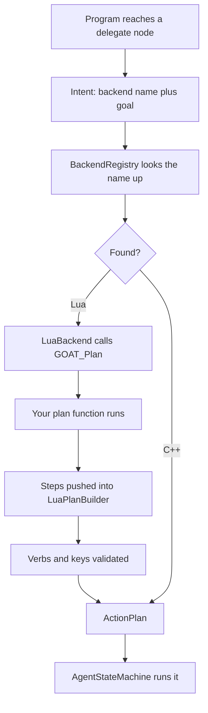

# Backends

> **Prerequisites:** [[Vocabulary]], [[Behavior DSL]]

---

## Two things are called "backend"

This trips people up, so it is worth being blunt about it.

**A decision backend is a paradigm.** It decides how a whole agent acts, every tick. `tree` and
`htn` are the two that ship, each in its own gem. You pick one with the **Brain** field on the
component. You cannot write one of these in Lua — see [[IDecisionBackend]].

**A `delegate` backend is a planner behind one leaf.** A program hits a `delegate` node, a
planner produces a short list of steps, the agent runs them. *This* is the one you can write in
Lua, and it is what the rest of this page is about.

The rest of the program is unaffected either way. A behaviour tree that delegates keeps being a
behaviour tree.

---

## Writing one

```lua
backend "Errand" {
    plan = function(me, ctx, goal)
        -- Return a list of steps, or nil when you cannot satisfy the goal.
    end,
}
```

| Parameter | Type | What it is |
| :--- | :--- | :--- |
| `me` | table | per-agent scratch state, yours to use |
| `ctx` | table | the blackboard context — `GetInt`, `SetBool`, `Key`, and so on |
| `goal` | string | whatever the `delegate` node's `goal` said |

Return a table of steps, or `nil`/`false` to fail. An empty table counts as a failure too — if
you have nothing to do, say so rather than returning nothing.

---

## What a step looks like

| Property | Type | What it does |
| :--- | :--- | :--- |
| `action` | string | **required.** The verb: `wait`, `script`, or a module verb like `move_to` |
| `behavior` | string | with `action = "script"`, names the Lua behaviour to run |
| `tag` | string | a label passed to the action |
| `seconds` | number | with `action = "wait"`, how long |
| `tolerance` | number | how close counts as arrived, for movement |
| `key` | string | a blackboard variable to act on |

---

## A full example

```lua
backend "Errand" {
    plan = function(me, ctx, goal)
        if goal == "Rest" then
            return { { action = "wait", seconds = 2.0 } }
        end
        return {
            { action = "script", behavior = "Announce" },
            { action = "wait", seconds = 0.5 },
        }
    end,
}
```

Used from a tree:

```lua
return tree "Errands" {
    sequence {
        script "Chore",
        delegate "Errand" { goal = "Deliver" },
        wait(0.25),
    },
}
```

---

## Declarative plans

If your planner is really just "try these in order until one fits", you do not need a function.
`plan` and `option` say the same thing declaratively:

```lua
plan "Deliver" {
    option { when = "has_package", { action = "script", behavior = "DropOff" } },
    option { { action = "wait", seconds = 1.0 } },
}
```

Options are tried in order and the first whose guard holds contributes all of its steps. Each
option takes `when` **or** `unless`, not both.

Prefer this. Declarative plans are **baked** at load time into steps that C++ already holds, so
running one later pushes nothing across the Lua boundary and allocates nothing. They are also
validated while you are still looking at the file, and the error names the line you wrote it on.

---

## Registration

You do not register anything. `GOATSystemComponent::RegisterLuaBackends` scans what Lua declared
after the vocabulary loads and wraps each one in a `LuaBackend`, which is the C++ class
implementing [[IBackend]].

A C++ backend of the same name wins; the Lua one is skipped.

---

## How a delegate resolves



---

## What will be rejected

- **Unknown verbs.** A step naming an action nothing registered fails the plan.
- **Undeclared keys.** A `key` must name a variable some `.bbx` declared.
- **Empty plans.** Returning `{}` is a failure, not a no-op.
- **Duplicate names.** A backend name has to be free, and it cannot collide with a `plan` name.

---

## Related

- [[IDecisionBackend]] — the other meaning of "backend"
- [[Vocabulary]]
- [[Behavior DSL]]
- [[IBackend]]
- [[LuaBackend]]
- [[Writing Custom Backends]]

---

*Last updated: 2026-08-27*
