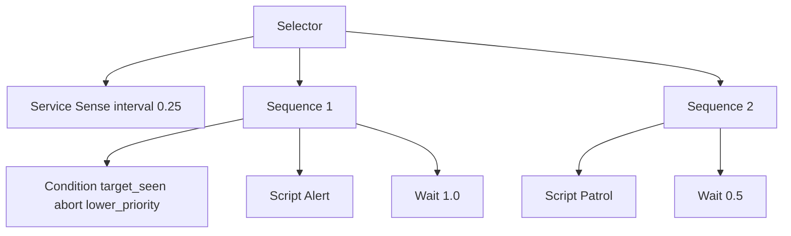

# Behavior DSL

> **Asset Type:** Lua Script  
> **Location:** `Assets/GOAT/Scripts/GOAT.lua`  
> **Prerequisites:** [[Vocabulary]]

---

## 📌 Purpose

The Behavior DSL is the **syntax designers use to write behavior trees** in Lua. It is a declarative, nested syntax that compiles down to a flat `DecisionProgram` for the C++ runtime. This document covers the core patterns: defining behaviors, building trees, using services, and reacting to conditions.

---

## 🧪 Basic Tree Structure

A tree is declared using the `tree` function. The body must be a single root node.

```lua
return tree "ExampleAgent" {
    selector {
        sequence {
            script "Patrol",
            wait(0.5),
        },
        sequence {
            script "Alert",
            wait(1.0),
        },
    },
}
```

**Breakdown:**

| Element | Description |
| :--- | :--- |
| `tree "ExampleAgent"` | Declares a tree named "ExampleAgent". |
| `selector { ... }` | A composite that runs children in order until one succeeds. |
| `sequence { ... }` | A composite that runs children in order until one fails. |
| `script "Patrol"` | A leaf that runs the `Patrol` behavior. |
| `wait(0.5)` | A leaf that waits 0.5 seconds. |

---

## 🧪 Defining Behaviors

Behaviors are the **atomic units of logic** in a tree. They are defined with `behavior` and can have `start`, `tick`, and `stop` phases.

```lua
behavior "Patrol" {
    start = function(me, ctx)
        me.stop = 0
    end,
    tick = function(me, ctx)
        me.stop = me.stop + 1
        ctx:SetInt("patrol_stop", me.stop)
        return SUCCESS
    end,
}
```

**Phases:**

| Phase | Description |
| :--- | :--- |
| `start(me, ctx)` | Called once when the behavior first begins. |
| `tick(me, ctx, dt)` | Called every frame while the behavior is active. |
| `stop(me, ctx)` | Called when the behavior finishes or is interrupted. |

**Return Values:**

| Return | Description |
| :--- | :--- |
| `SUCCESS` | Behavior completed successfully. |
| `FAILURE` | Behavior failed. |
| `RUNNING` | Behavior is still in progress. |

---

## 🧪 Using Services

Services are **periodic behaviors** attached to composites. They run at a fixed interval, allowing you to poll the world state without checking every frame.

```lua
selector {
    service "Sense" { interval = 0.25 },
    sequence {
        condition "target_seen" { abort = "lower_priority" },
        script "Alert",
        wait(1.0),
    },
    sequence {
        script "Patrol",
        wait(0.5),
    },
}
```

**How it works:**

1. The `service "Sense"` runs every 0.25 seconds, updating the blackboard.
2. The `condition "target_seen"` observes the blackboard key.
3. When `target_seen` flips to `true`, it aborts the `Patrol` branch.

---

## 🧪 Conditions and Aborts

Conditions are **decorators that check blackboard keys** and can abort lower-priority branches.

```lua
condition "target_seen" { abort = "lower_priority" }
```

**Abort Modes:**

| Mode | Description |
| :--- | :--- |
| `none` | No abort (default). |
| `self` | Aborts the condition itself if it becomes false. |
| `lower_priority` | Aborts any lower-priority sibling branches. |
| `both` | Aborts both the condition and lower-priority branches. |

---

## 🧪 Using Wait

The `wait` node pauses execution for a specified duration.

```lua
wait(1.0) -- Wait 1 second
```

---

## 🧪 Using Script

The `script` node runs a named behavior.

```lua
script "Patrol"
```

---

## 🧪 Using Raw Actions

The `raw` node runs a registered action verb directly, bypassing the behavior system.

```lua
raw "wait" { seconds = 0.25 }
```

This is useful for reaching verbs registered by modules (e.g., `MoveTo`, `PlayAnimation`) without needing to wrap them in a behavior.

---

## 🧪 Using Delegate

The `delegate` node asks a backend to produce a plan for a goal.

```lua
delegate "Errand" { goal = "Deliver" }
```

The backend (e.g., `LuaBackend` or a C++ backend) receives the goal and returns an `ActionPlan`.

---

## 🧪 Using Subtree

The `subtree` node inlines another named tree.

```lua
subtree "Guard"
```

This allows you to compose larger trees from reusable pieces.

---

## 🧪 Complete Example

```lua
-- Define behaviors
behavior "Patrol" {
    tick = function(me, ctx)
        ctx:SetInt("patrol_stop", me.stop)
        return SUCCESS
    end,
}

behavior "Alert" {
    tick = function(me, ctx)
        ctx:SetBool("alerted", true)
        return SUCCESS
    end,
}

behavior "Sense" {
    tick = function(me, ctx)
        ctx:SetBool("target_seen", ctx:GetInt("patrol_stop") % 4 == 0)
    end,
}

-- Define the tree
return tree "ExampleAgent" {
    selector {
        service "Sense" { interval = 0.25 },
        sequence {
            condition "target_seen" { abort = "lower_priority" },
            script "Alert",
            wait(1.0),
        },
        sequence {
            script "Patrol",
            wait(0.5),
        },
    },
}
```

---

## 🧪 Visual Overview



---

## ⚠️ Constraints & Validation

- **Blackboard Keys:** Referencing an undeclared variable will fail at compile time.
- **Child Counts:** A `sequence` must have at least one child; a `wait` must have zero children.
- **Unique Names:** Behavior names must be unique.
- **Root Node:** A tree must have exactly one root node.

---

## 🔗 Related Assets & Notes

- [[Vocabulary]]
- [[Flows]]
- [[Backends]]
- [[LuaDispatch]]

---

*Last updated: 2026-08-26*