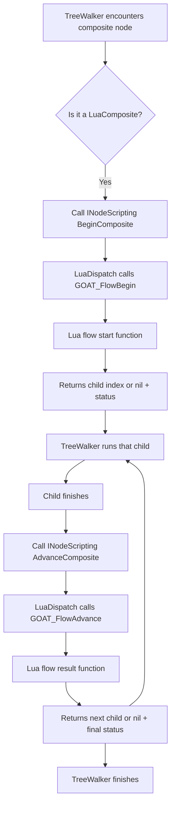

# Flows

> **Asset Type:** Lua Script  
> **Location:** `Assets/GOAT/Scripts/GOAT.lua`  
> **Prerequisites:** [[Vocabulary]], [[Behavior DSL]]

---

## 📌 Purpose

`flow` is the **escape hatch** that lets you write custom control flow for composites and decorators entirely in Lua. Instead of being limited to the built-in `selector` and `sequence`, you can define your own logic (e.g., "Run all children", "Run until failure", "Random selection").

A `flow` is registered by name and used in a tree via the `composite` or `decorator` node constructors.

---

## 🗝️ Flow Anatomy

A `flow` is defined with a `start` function (for composites) and a `result` function (for both composites and decorators).

```lua
flow "MyComposite" {
    start = function(me, ctx, childCount)
        -- Returns the first child to run (1-based index), or nil + status to finish.
    end,
    result = function(me, ctx, childIndex, childStatus)
        -- Returns the next child to run, or nil + final status to finish.
    end,
}
```

### Parameters

| Parameter | Type | Description |
| :--- | :--- | :--- |
| `me` | Table | Per-agent scratch state for this flow. |
| `ctx` | Table | The blackboard context (`SetBool`, `GetInt`, etc.). |
| `childCount` | Number | Total number of children (composites only). |
| `childIndex` | Number | The 1-based index of the child that just finished. |
| `childStatus` | Number | The result returned by the child (`SUCCESS`, `FAILURE`, `RUNNING`). |

### Return Values

| Return | Description |
| :--- | :--- |
| `(number)` | The 1-based index of the next child to run. |
| `(nil, status)` | The flow is finished; return the final `SUCCESS` or `FAILURE`. |

---

## 🧩 Composite Flows

Composite flows control **which child runs next**. They have both `start` and `result`.

### Example: `AllOf`

This flow runs *every* child, stopping only if one fails. It is a "Sequence but with custom logging".

```lua
flow "AllOf" {
    start = function(me, ctx, childCount)
        me.count = childCount
        return 1 -- Start at the first child
    end,
    result = function(me, ctx, childIndex, childStatus)
        -- If a child failed, the whole flow fails immediately.
        if childStatus == FAILURE then
            return nil, FAILURE
        end
        -- If there are more children, run the next one.
        if childIndex < me.count then
            return childIndex + 1
        end
        -- All children succeeded.
        return nil, SUCCESS
    end,
}
```

**Usage in a tree:**

```lua
composite "AllOf" {
    script "Announce",
    wait(1.0),
    script "Finish",
}
```

---

## 🧩 Decorator Flows

Decorator flows **filter the result** of their single child. They only have a `result` function. They do not have a `start` function.

### Example: `NeverFails`

This decorator forces whatever the child returns to be `SUCCESS`.

```lua
flow "NeverFails" {
    result = function(me, ctx, childStatus)
        return SUCCESS
    end,
}
```

**Usage in a tree:**

```lua
decorator "NeverFails" {
    script "Patrol",
}
```

---

## 🧩 Full Example (From `ExampleAdvanced.lua`)

```lua
-- Custom Composite: Run all children, fail fast.
flow "AllOf" {
    start = function(me, ctx, childCount)
        me.count = childCount
        return 1
    end,
    result = function(me, ctx, childIndex, childStatus)
        if childStatus == FAILURE then
            return nil, FAILURE
        end
        if childIndex < me.count then
            return childIndex + 1
        end
        return nil, SUCCESS
    end,
}

-- Custom Decorator: Always succeed.
flow "NeverFails" {
    result = function(me, ctx, childStatus)
        return SUCCESS
    end,
}

-- The tree using them.
return tree "ExampleAdvanced" {
    composite "AllOf" {
        decorator "NeverFails" { script "Chore" },
        delegate "Errand" { goal = "Deliver" },
        raw "wait" { seconds = 0.25 },
    },
}
```

---

## 🗺️ Visual Overview



---

## 🧠 How it Connects to C++

The `flow` function is executed via the `INodeScripting` interface (implemented by `LuaNodeScripting`). When the `TreeWalker` encounters a `LuaComposite` or `LuaDecorator` node, it calls:

1. **`BeginComposite`** → `LuaDispatch::CallFlowBegin` → `GOAT_FlowBegin` (for composites).
2. **`AdvanceComposite`** → `LuaDispatch::CallFlowAdvance` → `GOAT_FlowAdvance` (for composites).
3. **`FilterDecorator`** → `LuaDispatch::CallFlowFilter` → `GOAT_FlowFilter` (for decorators).

The `me` table is maintained in `GOAT._stateFor(agentKey, "flow:" .. flowName .. ":" .. nodeKey)` so each agent keeps its own private state for a specific flow instance.

---

## ⚠️ Constraints & Validation

- **Composites:** Must provide both `start` and `result` functions.
- **Decorators:** Must provide a `result` function; `start` is ignored.
- **Indexing:** Lua is 1-based, C++ is 0-based. `LuaDispatch` converts them automatically (`child - 1`).
- **State:** `me` is per-agent, per-flow-instance. It is reset when the agent is forgotten.

---

## 🔗 Related Assets & Notes

- [[Vocabulary]]
- [[Behavior DSL]]
- [[Backends]]
- [[LuaNodeScripting]]
- [[LuaDispatch]]

---

*Last updated: 2026-08-26*