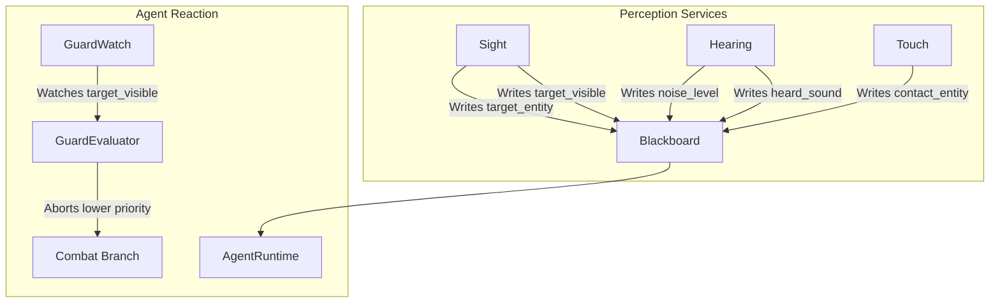

# Perception Module

> **Status:** Planned  
> **Target Version:** Future  
> **Related Folder:** `Code/Source/Modules/Animation/` (Potential)  
> **Build Flag:** `GOAT_WITH_ANIMATION=ON`

---

## 🎯 Objective

The Perception Module will provide a **centralized way for agents to sense the world**. Instead of hardcoding sensor logic into every behavior, this module will offer reusable services that poll the world state and write to the blackboard.

The core philosophy is that perception is **not a component**—it is a collection of **Lua services** that run on intervals, write to blackboard keys, and trigger agent reactions via guards.

---

## 🧠 Theoretical Approach

Following G.O.A.T.'s **Lua-First Authoring** and **Behavior-Driven Data** principles, Perception will be implemented as a set of **Lua `service` nodes** that poll the world and update the blackboard.

### Why a Service, Not a Component?
- **Performance:** Services run at fixed intervals, reducing CPU cost compared to per-frame checks.
- **Flexibility:** Designers can compose different sensor services per agent (sight, hearing, touch) by simply attaching them to their tree.
- **Lua-First:** Designers can customize sensor logic without touching C++.
- **Event-Driven:** Services write to blackboard keys, which `GuardWatch` watches. This means agents only re-evaluate conditions when a sensed value actually changes.

---

## 🗂️ Proposed File Structure

```text
Code/Source/Modules/Animation/
├── SightService.lua
├── HearingService.lua
├── TouchService.lua
└── CMakeLists.txt
```

The services themselves are authored in Lua, so they live in the `Assets` folder rather than `Code`.

---

## 📜 Proposed Public API (Lua Services)

### SightService

```lua
behavior "Sight" {
    tick = function(me, ctx)
        -- Poll O3DE's view/visibility system
        local target = GetNearestVisibleEntity(ctx:GetSelf())
        ctx:SetEntity("target_entity", target)
        ctx:SetBool("target_visible", target:IsValid())
    end,
}
```

### HearingService

```lua
behavior "Hearing" {
    tick = function(me, ctx)
        local noise = GetNoiseAt(ctx:GetSelf())
        ctx:SetFloat("noise_level", noise)
        ctx:SetBool("heard_sound", noise > 0.5)
    end,
}
```

### TouchService

```lua
behavior "Touch" {
    tick = function(me, ctx)
        local contact = GetContactEntity(ctx:GetSelf())
        ctx:SetEntity("contact_entity", contact)
        ctx:SetBool("in_contact", contact:IsValid())
    end,
}
```

---

## 🧪 Example Usage in Lua

Once implemented, designers will combine these services in their trees:

```lua
return tree "GuardAgent" {
    selector {
        service "Sight" { interval = 0.1 },
        service "Hearing" { interval = 0.25 },
        sequence {
            condition "target_visible" { abort = "lower_priority" },
            delegate "Combat" { goal = "EngageTarget" },
        },
        sequence {
            condition "heard_sound" { abort = "lower_priority" },
            script "InvestigateNoise",
        },
        script "Patrol",
    },
}
```

---

## 🗺️ Visual Overview



---

## 🧠 How it Connects to C++

The Perception Module is entirely **Lua-based**. It does not introduce new C++ components. Instead:

1. **Services** are defined in Lua using the existing `behavior` DSL.
2. They are attached to trees using `service "Sight" { interval = 0.1 }`.
3. They write to blackboard keys via `ctx:SetBool`, `ctx:SetEntity`, etc.
4. `GuardWatch` watches those keys and wakes the agent only when they change.
5. `GuardEvaluator` re-checks conditions and triggers aborts.

This means the Perception Module is essentially a **library of Lua scripts**, not a C++ module.

---

## ✅ Implementation Checklist

- [ ] Write `SightService.lua` that polls visibility and writes to blackboard.
- [ ] Write `HearingService.lua` that polls noise and writes to blackboard.
- [ ] Write `TouchService.lua` that polls contact and writes to blackboard.
- [ ] Provide example trees using these services.
- [ ] Document supported blackboard keys (e.g., `target_entity`, `target_visible`, `noise_level`, `heard_sound`, `contact_entity`).
- [ ] Test with `GuardWatch` to ensure agents wake only when sensor values change.

---

## 🔗 Related Notes

- [[Design Principles]]
- [[Performance Model]]
- [[Behavior DSL]]
- [[GuardWatch]]
- [[GuardEvaluator]]

---

*Last updated: 2026-08-26*