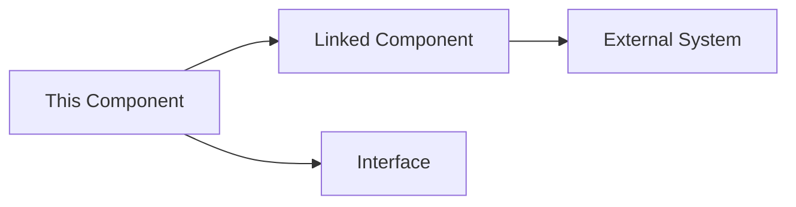

# {{Title}}

> **File Location:** `Code/Source/.../{{FileName}}.cpp`  
> **Header:** `Code/Include/.../{{FileName}}.h`  
> **Inherits:** `AZ::Component` / `IActionState` / `IBackend`  

---

## Overview

{{One-paragraph, high-level description of what this component does and why it exists in the framework.}}

---

## Key Responsibilities

| # | Responsibility | Description |
| :--- | :--- | :--- |
| 1 | **{{Responsibility 1}}** | {{Explain what it handles and how.}} |
| 2 | **{{Responsibility 2}}** | {{Explain what it handles and how.}} |
| 3 | **{{Responsibility 3}}** | {{Explain what it handles and how.}} |

---

## Public Interface

### Methods

```cpp
// {{Return Type}} {{MethodName}}({{Parameters}});
// {{One-line description of the method's purpose.}}
```

### Data Members

| Member | Type | Description |
| :--- | :--- | :--- |
| `m_{{member}}` | `{{Type}}` | {{Description}} |

---

## Dependencies & Interactions



- **Depends on:** [[Related Interface]]
- **Required by:** [[Parent Component]]
- **Interacts with:** [[Other Component]]

---

## Implementation Notes

### Key Algorithms

{{Describe the core logic, e.g., "The `TreeCompiler` performs a pre-order traversal and flattens the node graph into a contiguous array, tracking subtree boundaries for O(1) sibling navigation."}}

### Performance Considerations

- **Allocation:** {{Where memory is pooled or pre-allocated.}}
- **Tick Rate:** {{At what frequency this runs.}}
- **Concurrency:** {{Main thread / Worker thread.}}

---

## Lua Exposure

{{Describe how this is accessible from Lua, if at all.}}  
Example:

```lua
-- Example usage in a Lua tree
script "BehaviorName"
raw "VerbName" { key = "target_key" }
```

---

## Testing

{{Describe unit tests or manual verification steps.}}

---

## Related Notes

- [[Related Note 1]]
- [[Related Note 2]]

---

*Last updated: {{date}}*