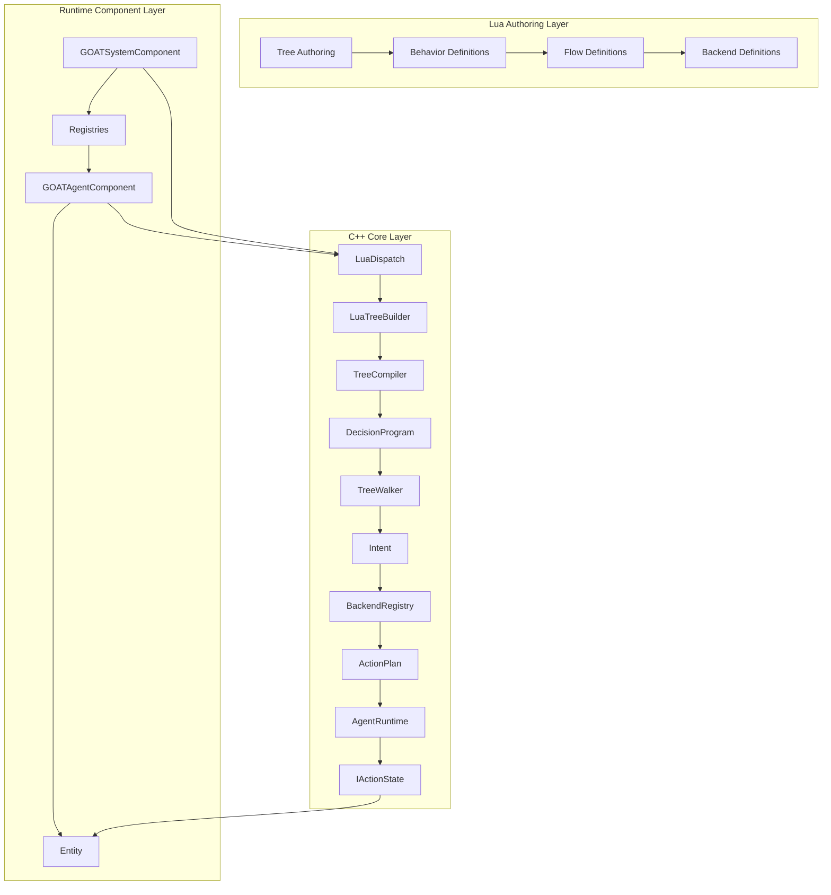

# Layered Overview

> **Category:** Architecture Overview  
> **Status:** Implemented  
> **Core Files:** `Code/Source/Clients/GOATAgentComponent.cpp`, `Code/Source/Core/Application/GOATSystemComponent.cpp`, `Code/Source/Core/Scripting/LuaDispatch.cpp`, `Code/Source/Core/Frontend/TreeCompiler.cpp`

---

## 💡 Core Concept

G.O.A.T. is organized into **three distinct layers**, each with a clear responsibility. This separation ensures that the framework remains modular, testable, and easy to extend.

| Layer | Responsibility | Example Files |
| :--- | :--- | :--- |
| **Lua Authoring Layer** | Define trees, behaviors, flows, backends | `GOAT.lua`, `ExampleAgent.lua` |
| **C++ Core Layer** | Compile, execute, plan, manage agents | `TreeCompiler`, `TreeWalker`, `AgentRuntime` |
| **Runtime Component Layer** | Bridge O3DE entities to the AI system | `GOATAgentComponent`, `GOATSystemComponent` |

---

## 🗺️ Visual Overview



---

## 🧩 Layer Details

### 1. Lua Authoring Layer

**Purpose:** Provide a designer-friendly DSL for authoring AI behavior.

**Key Components:**

- `GOAT.lua` – Defines the vocabulary (`tree`, `behavior`, `flow`, `backend`, node constructors).
- User scripts – `ExampleAgent.lua`, `ExampleAdvanced.lua`.

**What happens here:**

- Designers write trees using the DSL.
- The `tree` function compiles the node graph into a flat record list.
- The `GOAT_EmitTree` function pushes this data into the C++ builder.

**Example:**

```lua
-- Author a tree entirely in Lua
behavior "Patrol" {
    tick = function(me, ctx)
        ctx:SetInt("patrol_stop", me.stop)
        return SUCCESS
    end,
}

return tree "ExampleAgent" {
    selector {
        sequence {
            condition "target_seen" { abort = "lower_priority" },
            script "Alert",
            wait(1.0),
        },
        sequence {
            script "Patrol",
            wait(0.5),
        },
    },
}
```

---

### 2. C++ Core Layer

**Purpose:** Execute the authored trees, manage agent lifecycles, and handle planning.

**Key Components:**

| Component | Responsibility |
| :--- | :--- |
| `LuaDispatch` | Calls into Lua (`GOAT_EmitTree`, `GOAT_Dispatch`, `GOAT_Plan`). |
| `LuaTreeBuilder` | Reconstructs `BehaviorTreeNode` hierarchy from flat Lua calls. |
| `TreeCompiler` | Validates and flattens the tree into a `DecisionProgram`. |
| `TreeWalker` | Iteratively traverses the `DecisionProgram`, emitting `Intent`s. |
| `BackendRegistry` | Stores registered `IBackend` implementations. |
| `AgentRuntime` | Executes `ActionPlan`s through registered `IActionState`s. |
| `AgentRegistry` | Tracks all running agents. |
| `BlackboardSystem` | Manages the blackboard schema and storage. |

**What happens here:**

- `GOATSystemComponent` initializes all core services.
- `GOATAgentComponent` calls `LoadScript`, `CompileTree`, and `RegisterAgent`.
- `TreeCompiler` validates the tree against known node types and blackboard schema.
- `TreeWalker` runs the tree, producing `Intent`s for backends.
- Backends produce `ActionPlan`s that `AgentRuntime` executes.

---

### 3. Runtime Component Layer

**Purpose:** Bridge O3DE entities to the AI system.

**Key Components:**

- `GOATAgentComponent` – Attaches to an entity, loads assets, and registers the agent.
- `GOATSystemComponent` – Registers services, owns the registries, and provides the `IAgentSystem` interface.

**What happens here:**

- `GOATAgentComponent::Activate()` loads blackboard assets, Lua scripts, and compiles the tree.
- It then calls `RegisterAgent` to get an `AgentId`.
- `GOATSystemComponent` implements `IAgentSystem` and provides the public API for modules.

**Example:**

```cpp
// Code/Source/Clients/GOATAgentComponent.cpp
void GOATAgentComponent::Activate()
{
    IAgentSystem* agents = AgentSystemInterface::Get();
    if (agents == nullptr)
    {
        AZ_Warning("GOAT", false, "The GOAT agent system is not available");
        return;
    }

    // Load blackboard assets
    for (auto& blackboard : m_blackboards)
    {
        if (EnsureLoaded(blackboard))
        {
            agents->LoadBlackboard(*blackboard.Get());
        }
    }

    // Load Lua scripts
    for (auto& script : m_scripts)
    {
        if (EnsureLoaded(script))
        {
            agents->LoadScript(script);
        }
    }

    // Compile and register the tree
    if (auto compiled = agents->CompileTree(AZ::Name(m_treeName)); !compiled.IsSuccess())
    {
        AZ_Warning("GOAT", false, "%s", compiled.GetError().c_str());
        return;
    }

    m_agent = agents->RegisterAgent(GetEntityId(), AZ::Name(m_treeName), static_cast<size_t>(m_band));
}
```

---

## ⚖️ Trade-offs

| ✅ Advantage | ⚠️ Disadvantage |
| :--- | :--- |
| Clear separation of concerns | Requires understanding all three layers |
| Lua makes authoring fast | Lua errors can be hard to debug |
| C++ core is performant | Compile-time validation adds complexity |
| Modular and extensible | More files to navigate |

---

## 🧩 Impact on the Codebase

### Lua Layer
- `GOAT.lua` is the single source of truth for the DSL.
- User scripts register behaviors, backends, and trees.

### C++ Core
- `GOATSystemComponent` starts all services.
- `GOATAgentComponent` drives the runtime behavior.

### Runtime
- Agents are registered and ticked via `AgentRegistry`.

---

## 🔗 Related Notes

- [[Data Flow]]
- [[Blackboard System]]
- [[GOATSystemComponent]]
- [[GOATAgentComponent]]

---

*Last updated: 2026-08-26*